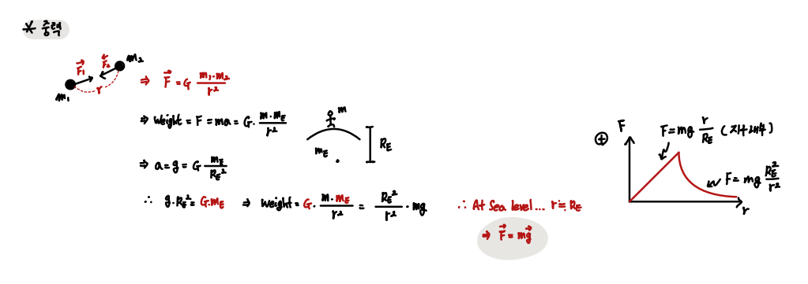
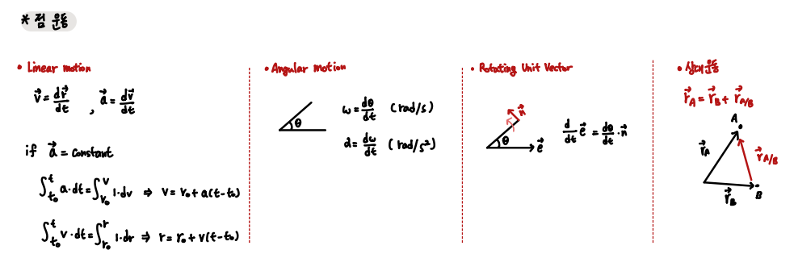
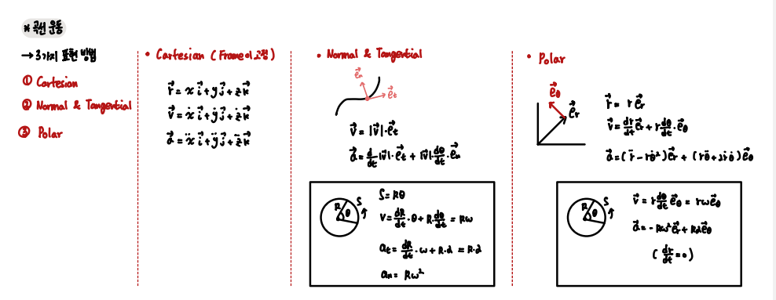

## Gravity and motion of a point `Ch 12 - 13`

Ch 12 - 13은 점의 운동과 중력에 대한 얘기

#### Newtonian Gravity

- Gravity 

`유의할 것은 일반적으로 사용하는 중력 식은 Sea Level을 상정한다는 것`

 

- Motion of a Point

`선형 운동, 각 운동, 상대 운동 그리고 이를 표현하는 방법은 크게 다음 3 가지가 있다.`

`1. Cartesian 2. Normal and Tangential 3. Polar form `

