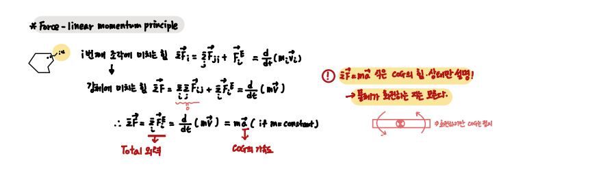
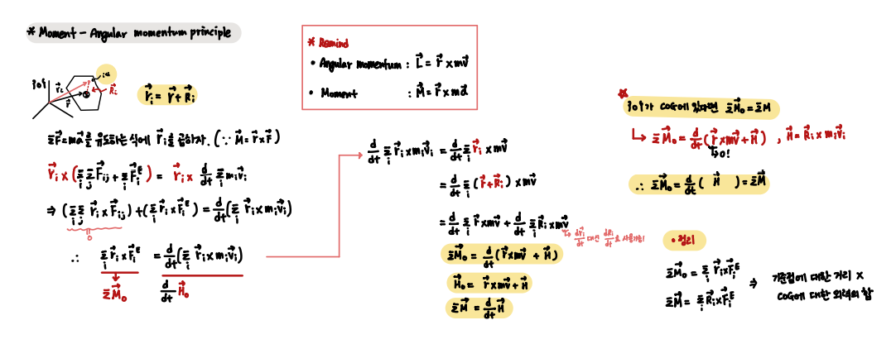
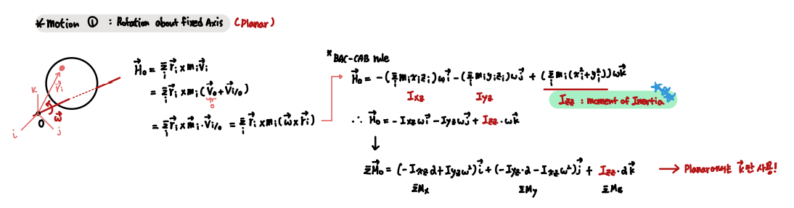
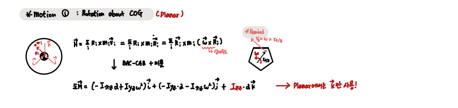
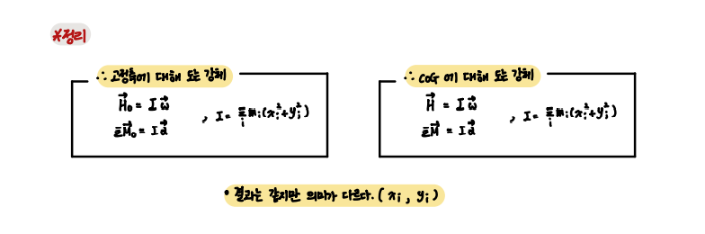
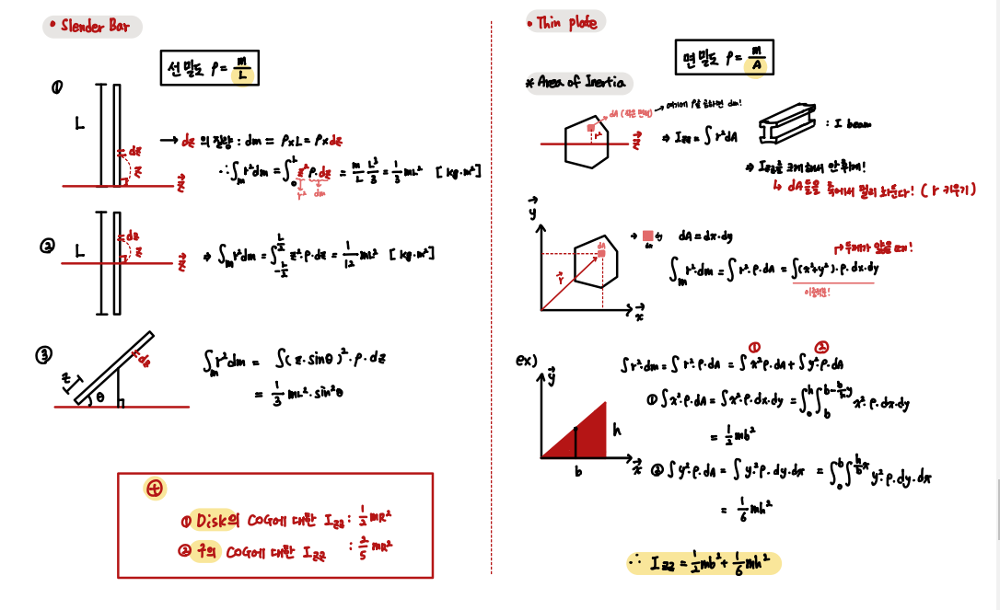
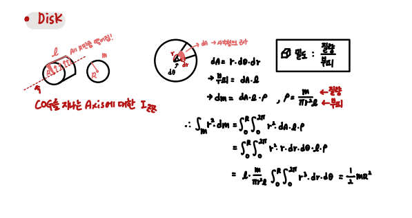
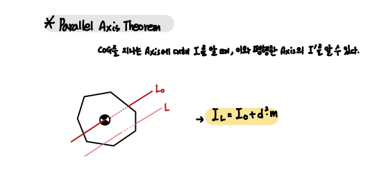
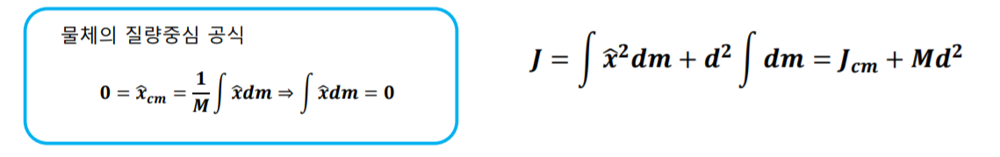

## Planar Dynamic of Rigid Body `CH 18`

`강체에 대한 평면 역학`

    여태 알아본 점의 위치, 속도 그리고 가속도를 만들어내는 힘에 대해 알아본다.

- List 

1. Force - Linear momentum principle
2. Moment - Anguler momentum principle
3. Motions
4. Moment of Inertia
5. Parallel Axis Theorem

---

- Force - Linear momentum Principle

다시 한 번 System 내의 힘과 COG의 가속도 간의 관계인 F = ma를 유도해본다. 

        F = ma 식은 물체의 COG에 대한 힘과 상태만 설명할 뿐, 회전에 대한 정보는 얻을 수 없다.

 

- Moment - Anguler momentum principle

`따라서 물체의 회전 운동을 설명하기 위해 모멘트(토크, 돌림힘)와 각 운동량의 관계식을 사용한다.` 

`M`과 `H`를 다루는 과정에서는 해당 moment와 momentum의 `기준 좌표가 어디인지 꼭 확인해야한다.` 

 

- Motions 

1. 고정축에 대한 회전

 

2. COG에 대한 회전 
 

 

`정리하자면 다음과 같다.`

위 두 motion의 momentum 결과식은 같다.

하지만 그 의미가 다르므로 유념하며 상황에 맞게 사용하자.

 

- Moment of Inertia

**매우매우 중요한 부분이다.** 

    실제로 어떤 로봇을 구현할 때, 모든 Parts들의 Inertia를 고려하여 설계해야한다.

`Planar motion에서 Moment of Inertia는 Z 축에서의 수직 거리에 있는 질점의 적분이다.` 

 

`Slender Bar and Thin Plate`

 

`Disk`

 

- Parallel Axis Theorem 

반드시 COG를 통과하는 Axis에 대해 적용시켜야한다.

 

