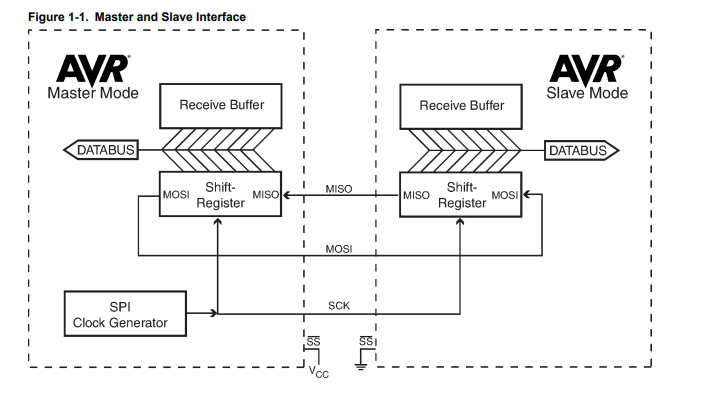

### SPI 통신 (마스터 슬레이브 통신)

SPI를 사용하면 AVR과 주변 장치 간 또는 여러 AVR 장치간 고속 동기 데이터 전송이 가능하다.  
AVR이 마스터 모드 또는 슬레이브 모드 중 어떤 것으로 실행되는지는 `SPCR 레지스터의 마스터 비트 MSTR로 설정` 

마스터 장치는 SPI 통신이 활성화되면 Clk 신호를 슬레이브 장치에 제공해야한다. (동기 통신을 위해..)

마스터 장치가 Clk신호를 만들면 슬레이브 장치는 마스터 장치에 데이터를 보내고 받을 수 있다.  
마스터 장치는 데이터를 보내는 동안에만 Clk 신호를 생성하기 떄문에 슬레이브 장치로부터 데이터를 읽기 위해 슬레이브 장치로 데이터를 보내야한다.

- Register

`SPDR` : SPI Data Register  
`SPSR` : SPI Status Register  
`SPCR` : SPI control Register  

[link](https://webnautes.tistory.com/994)