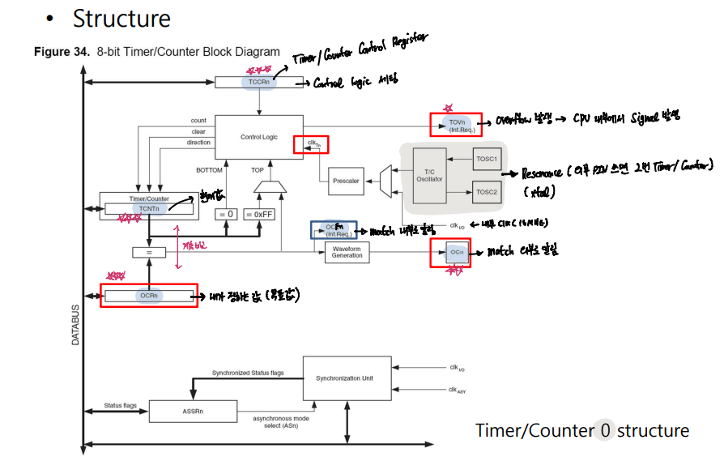

### Timer Counter

1. Timer 0 , 2 

        8 Bit : 0 ~ 255

2. Timer 1, 3

        16 bit : 0 ~ 65535

- Notation

`Bottom` : Minimul Value   
`MAX` : Maximum Value  
`Top` : Operation Mode에 따른 최대 값

`TCNT` : Count한 값을 저장하는 레지스터  
`TOVn` : Timer Overflow Interrupt 생성기 (0, 1, 2, ... 255 -> Interrupt Arise -> 0, 1, 2, ... )  
`OCF`  : 내부적으로 내가 정한 값과 Match되면 알려주는 PIN  
`OC`   : 외부적으로 내가 정한 값과 Match되면 알려주는 PIN   
`OCR`  : 내가 정하는 값 --- TCNT 값과 계속 비교된다. (이 값을 통해 PWM 출력 제어 가능)

`TCCR` : Timer Counter Control Register --- Control Logic 설정  
   
    `COM`  : OC PIN의 작동 모드   
    `WGM`  : Operation Mode 선택 Normal Count / CTC / PWM / Fast PWM ...  
    `CS`   : 분주비

    `Operation Mode 

      Normal : 그냥 세기 
      CTC : Clear Timer on Compare Match --- Match되면 TCNT 값 초기화 (0 ~ OCR Value 까지 Count)

`SREG` : Global Interrupt Enable PIN   
`TIMSK` : Timer/Counter Interrupt Mask Register
 
    `OCIE` : Output Compare Match 됬을 때 Interrupt 발생 Enable -- 발생시 OCF = 1로 Set! 
    `TOIE` : Overflow Interrupt 발생 Enable --- 발생시 TOV = 1로 Set !

`TIFR` : Timer/Counter Interrupt Flag Register

    Interrupt 발생 -> Flag = 1 -> ISR 진입 -> Flag = 0 

    `OCF` / `TOV` / `ICF`

`Timer 0 Structure`

