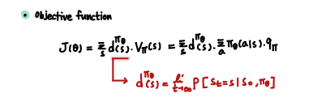
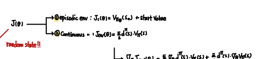
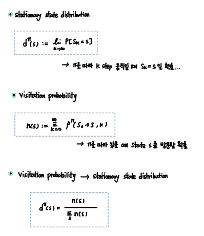
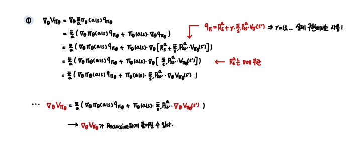
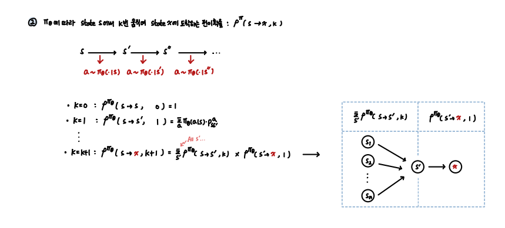
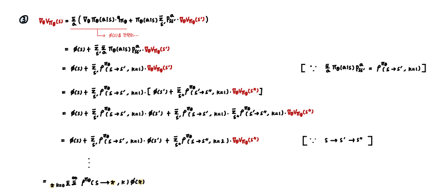
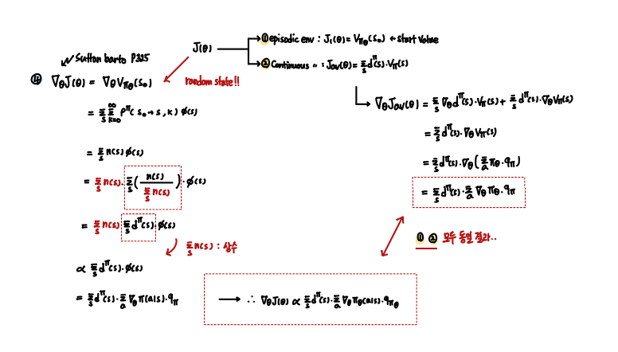
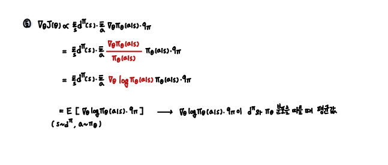

### Policy Gradient Theorem 증명

PG Base Algorithm의 충분한 이해를 위함..

- Reference 

[1] SuttonBarto_2nd_pdf   
[2] https://lilianweng.github.io/lil-log/2018/04/08/policy-gradient-algorithms.html   
[3] https://talkingaboutme.tistory.com/entry/RL-Policy-Gradient-Algorithms

---

 

- `Objective Function`

       모델을 평가하는 방법 1. Value function 2. Action Value function

       PG의 목적은 GD Method를 통해 모델을 향상시키는 것이므로 목적함수가 Value , Action Value function의 형태.

Continuous State에 대한 Objective Function

Episodic한 경우 Start Value를 통해 Objective Function을 정의할 수도 있다.

위 두가지 형태 모두 동일한 Gradient 결과를 반환한다. (이후 증명)

 

- `Policy Gradient Theorem` 

PG Theroem은 GD Method에 필요한 `Objective function의 미분`이 다음과 같은 형태로 나타남을 의미한다. 

 

- `Stationary State Distribution & Visitation Probability`

 

- `Proof of PG Theorem`

