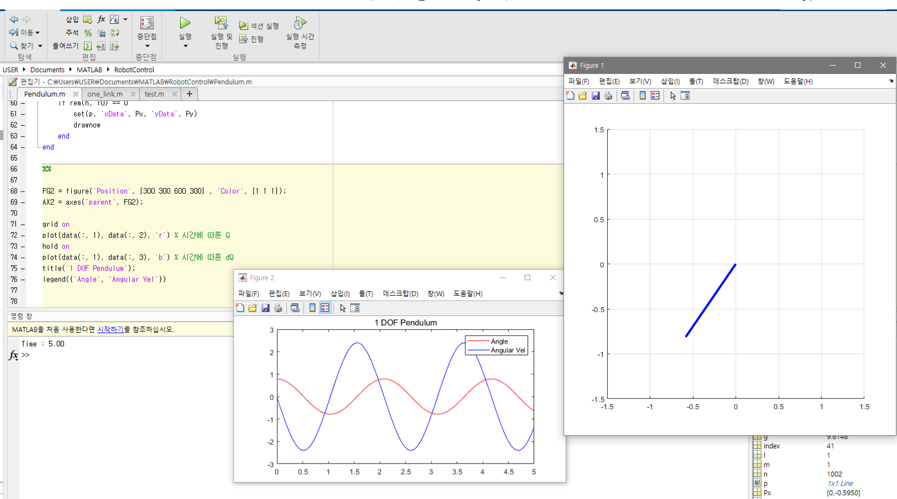

#### 1 DOF Pendulum Modeling & Simulation

1. Lagrangian method를 이용하여 Motion of Equation을 구한다.
2. 제어 입력을 넣지 않은 Natural Response를 관찰할 것 
3. 각가속도를 구하고, 수치적분을 이용하여 각도, 각속도를 구한다.
4. Forward Kinematic를 이용하여 시간에 따른 End - Effector의 위치를 Plotting한다.

`Simulation Result` 

