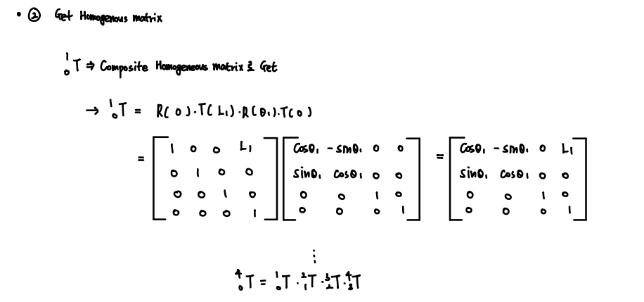

### 정기구학 / 역기구학

1. Joint Variable들을 가지고 말단부의 위치와 방향을 파악하자.
2. 말단부의 위치와 방향을 가지고 각 Joint Variable들을 파악하자.
  
    _Inverse Kinematics를 Jacobian을 이용해서 구할 수도 있다. 이 부분은 Jacobian part에서 다루자._

        Inverse Kinematics는 Solution을 구하기 어렵고, 해가 존재 하지 않는 경우도 많다.
        이 해는 Robot에 의존적이며, 특수한 경우에 대해서 성립하는 Closed form Solution이 존재한다.
        해당 강의에서는 Stanford Arm, PUMA 560, MINIMOVER와 같은 특수한 로봇에 대해서만 해를 구한다.

 

#### Background

Kinematics를 수행하기전 로봇운동학에서 배운 가장 기본적인 배경지식은 있어야한다.

공부를 진행하며 부족한 부분은 계속 보충하도록 하자.

    1. Mapping / Operation
    2. Rotataion Matrix ( SO(3) matrix )

        - Rotation Matrix를 각 Axis에 대해 내적해서 구할 수 있다.

        - Rotation Matrix를 순차적으로 회전하여 구할 수도 있다.
             - Euler Angle
             - Fixed Axis Angle (Roll Pitch Yaw)
             - 로드리게스 formular

        위 방법 중에서 Euler Angle과 Roll pitch Yaw를 많이 사용한다. 

    3. Homogeneous transformation matrix --- 매우 중요
        - Compound Arithmatic

 

#### Forward Kinematics

정기구학을 수행하는 단계는 다음과 같다.

    1. D-H Parameter를 이용해서 좌표계를 세우고 Joint 변수를 구한다.
    2. 얻어진 변수들을 통해 Transformation matrix를 구한다.
    3. Compound Arithmatic을 이용하여 Base 좌표에서 말단 좌표에 대한 위치와 방향을 구한다.
    4. 필요하다면 방향 성분에 대해서 Roll Pitch Yaw 또는 Euler Angle 표현을 구한다.

4번 단계에 대한 얘기는 조금 생소할 수 있지만 다음과 같다.

Transformation matrix들의 계산 결과로 나오는 방향 결과는 매우 복잡하고 비직관적이다.

하지만 결국 이는 기준 좌표계에 대해서 회전한 좌표계 이므로, Roll Pitch Yaw와 같은 방법으로 각 축에 대해 회전한 양만을 구할 수 있다.

 

`Step 1 : D-H Parameter를 이용해서 Joint 변수 구하기`

 

`Step 2 & 3 : Transformation Matrix 구하기`

위와 같은 연산을 통해 말단 부의 기준 좌표계에 대한 위치와 방향을 정의할 수 있다. 

 

`Step 4 : 방향 성분의 직관적인 표현 구하기`

위치 벡터는 직관적이라 바로 사용가능하지만, 방향 성분은 매우 복잡하게 나온다. (9개의 원소들)

따라서 직관적이고 간단하게 표현하기 위해 Roll Pitch Yaw의 표현법으로 바꾼다. (이렇게 해도 같은 방향을 나타낸다)

    방법은 계수 비교법이다. 

 

#### Inverse Kinematics

역기구학은 해를 구하기가 매우 까다롭다.

일반적인 풀이법이 없을 뿐더러 로봇마다 그 해가 다르기 때문이다.

우리는 Stanford Arm의 주어진 해를 가지고 계수 비교를 진행하며 Joint 변수들을 하나씩 찾아낸다.

 
