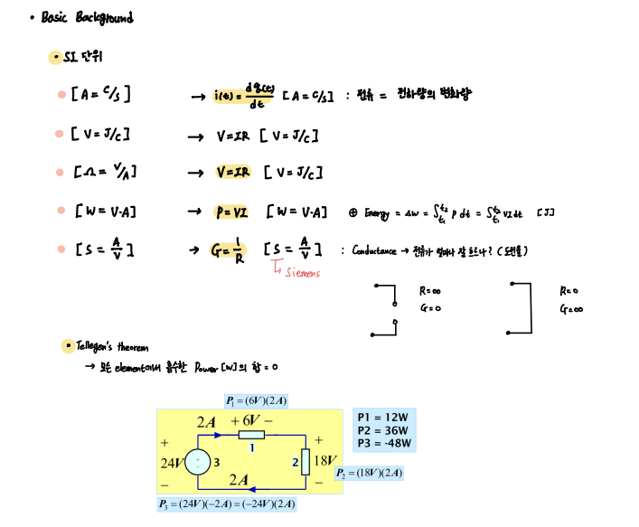
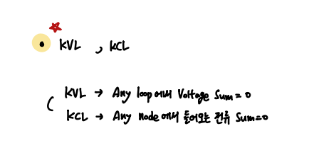
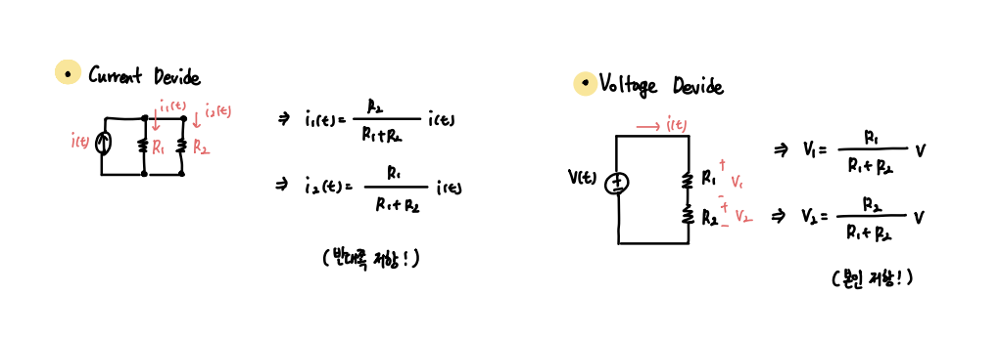
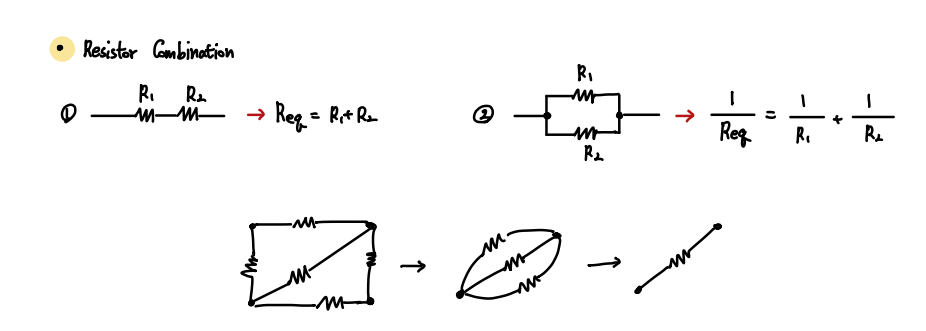
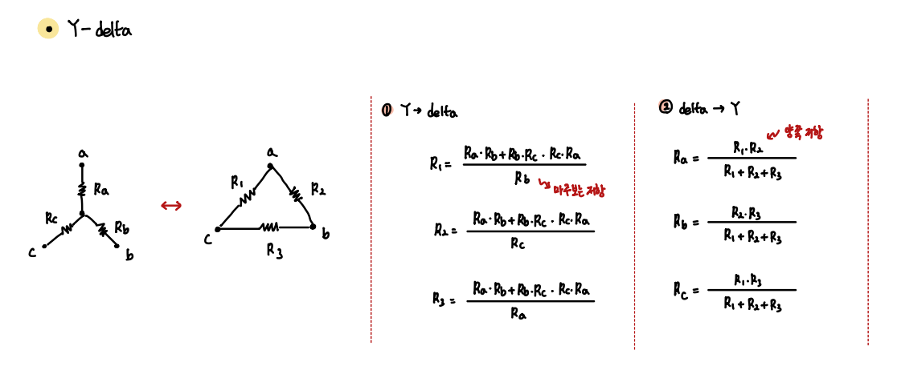
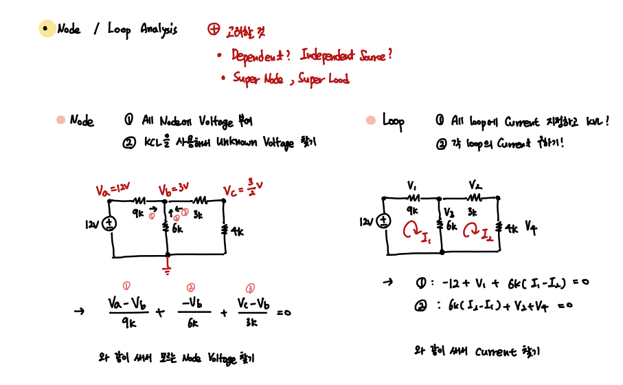

### Basic Theorems

- 회로해석을 위한 기본 지식 정리

  

- List

1. SI Unit
2. Tellgen's Theorem
3. KVL, KCL
4. Current Divide, Voltage Divide
5. Resistor Combination
6. Wye-Delta Transformation
7. Node / Loop Analysis

---

- SI Unit and Basic Electrical Rules

머릿속에 꼭 저장해두고 사용해야할 기본적인 회로 공식들이다.

`P = VA` & `V = IR`

그리고 모든 전기적 소자에서 사용한 전력의 합은 0임을 기억하자.

 

- KCL, KVL, Element Division

`KCL, KVL`

 

`Division (Current, Volatage)`

 

- Resistor Combination ( Circuit을 간단하게 만드는 방법 )

    이후 다룰 Capacitor와 Inductor에 대해서도 비슷하게 할 수 있다.

 

- Wye-Delta Transformation

AC Input에서 위상 변화에 사용하는 유용한 공식이니 꼭 기억하자.

 

- Circuit Analysis Method (Node, Loop)

회로를 분석하는 가장 기본적인 Method 두 가지 

