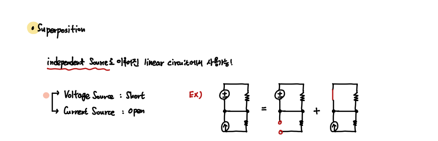
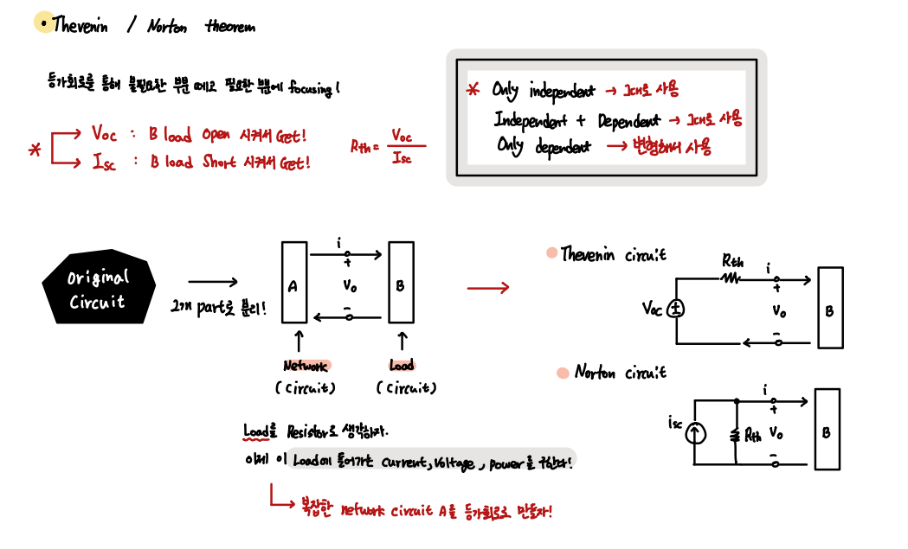
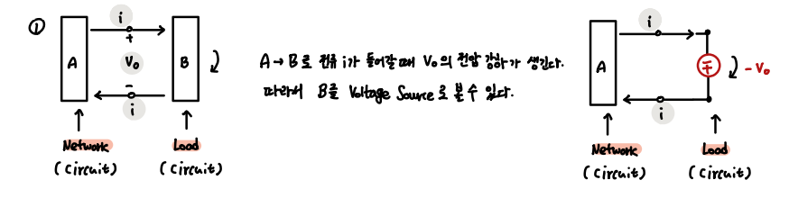
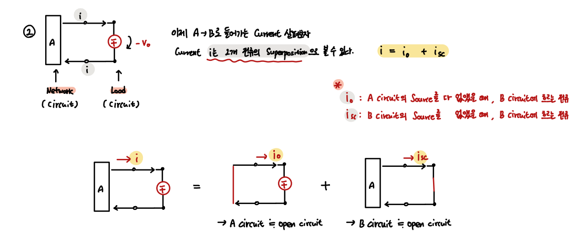
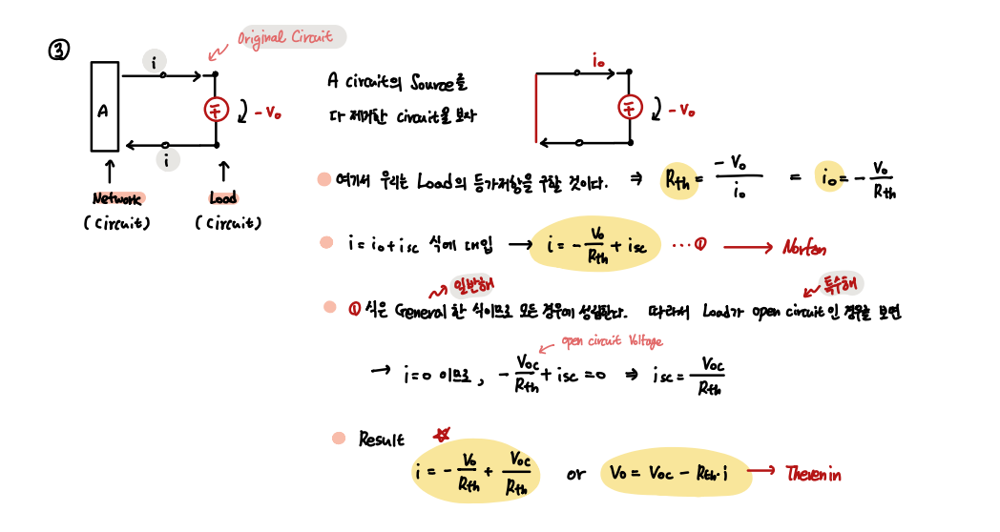
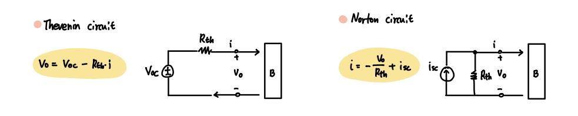
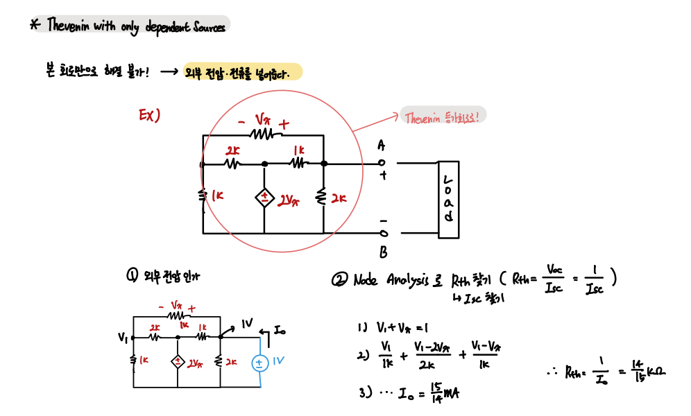
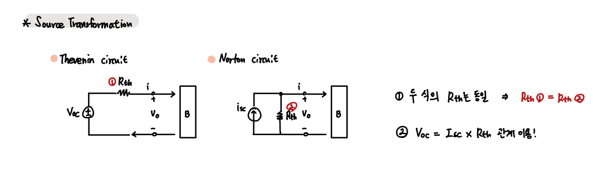
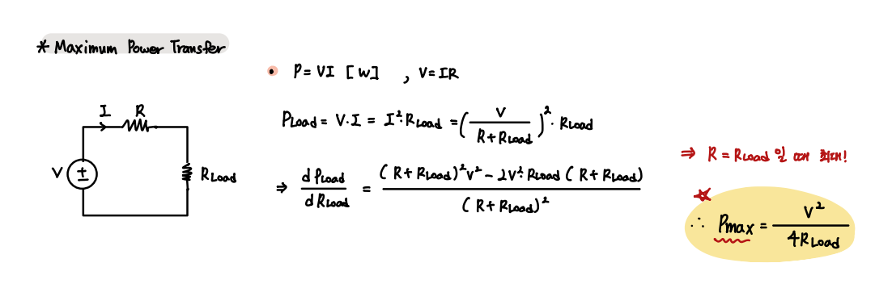

### Thevenin and Norton

Circuit을 간단하게 하는 아주 중요한 Theorem 

- List

1. Superposition
2. Thevenin and Norton Theorem
3. Source Transformation
4. Maximnum Power Transfer

---

- Superposition 

Linear Circuit은 Superposition 성질을 만족한다.

`1. Linearity` `2. Homogeneuity`

Superposition을 사용해서 복잡한 회로를 하나씩 분석하며 해결할 수 있다.

 

- Thevenin and Norton Theorem

`Thevenin / Norton은 복잡한 회로를 간단한 등가회로로 만들어 분석하는 방법이다.`

 

- Proof of Thevenin and Norton Theorem

Thevenin / Norton은 언뜻 보기에 말이 안되보일 수 있으므로, 차근차근 그 타당성을 이해해보자.

`결과`

 

Thevenin / Norton은 Input Source에 따라 사용방법이 상이하다.

    Only Independent Source와 Independent + Dependent Source에 대해서는 기존 방법을 사용한다.

    하지만 Only Dependent Source에 대해서는 외부 전원을 넣어주어 해결한다.

 

- Source Transformation

       Thevenin과 Norton은 서로 등가회로이다.
       따라서 때에 따라 Thevenin과 Norton을 바꾸어 가며 회로를 단순화 시킬 수 있다.

 

- Maximum Power Transfer

Thevenin 등가회로에서 가장 유용하게 쓰이는 부분이 바로 이 부분이다.

`등가회로를 통해 Thevenin 저항을 얻고, 이 저항을 Load저항과 같게 해주면 최대 출력을 얻을 수 있다.`

