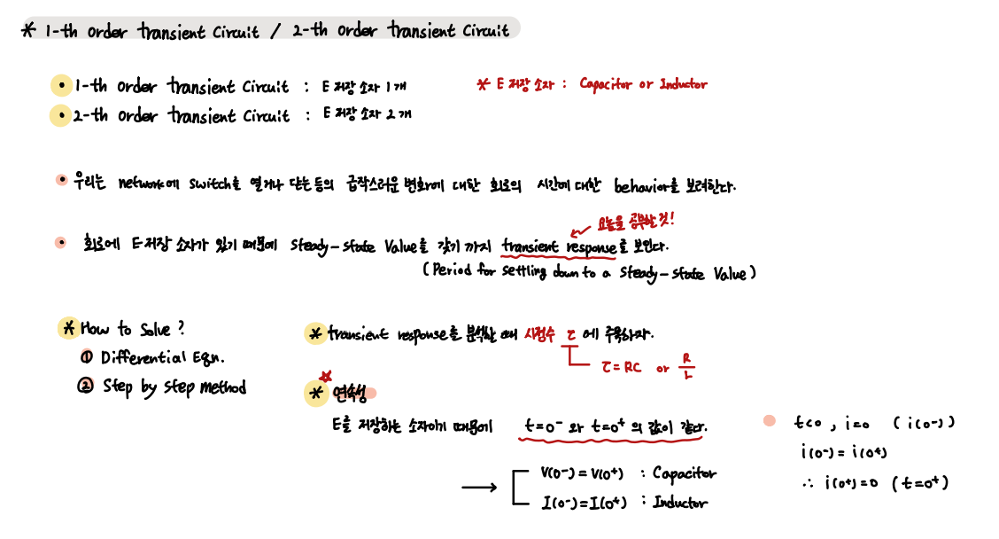
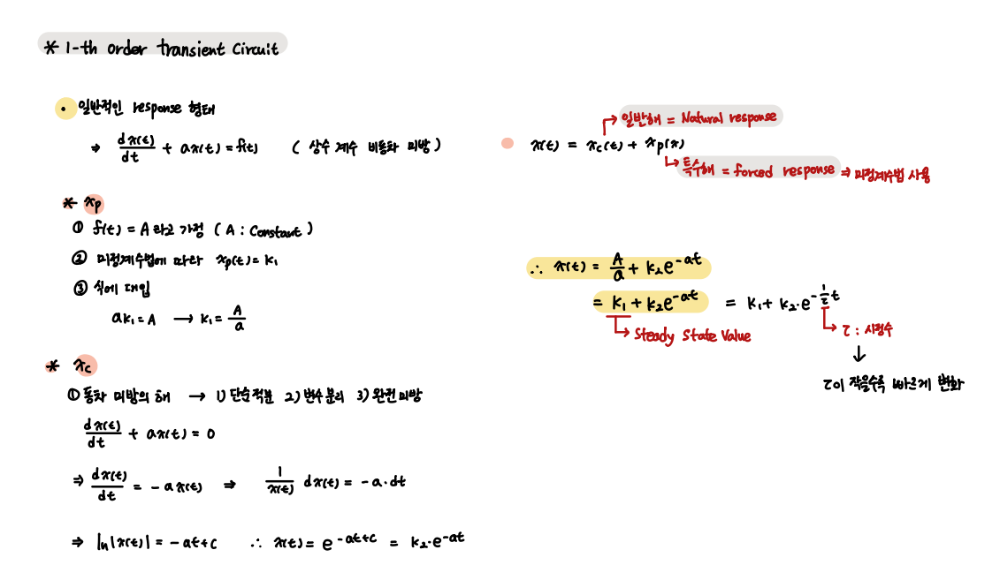
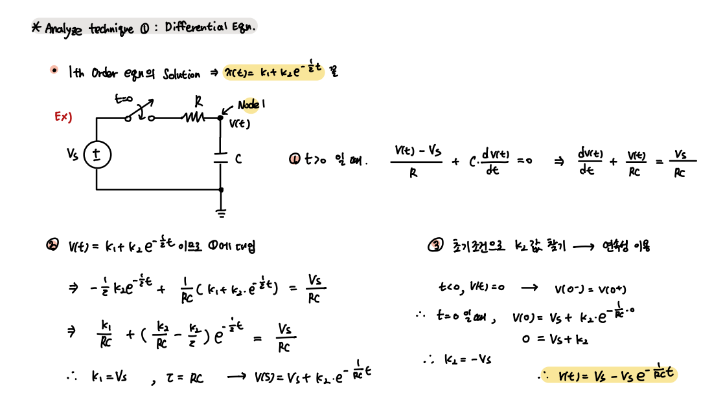
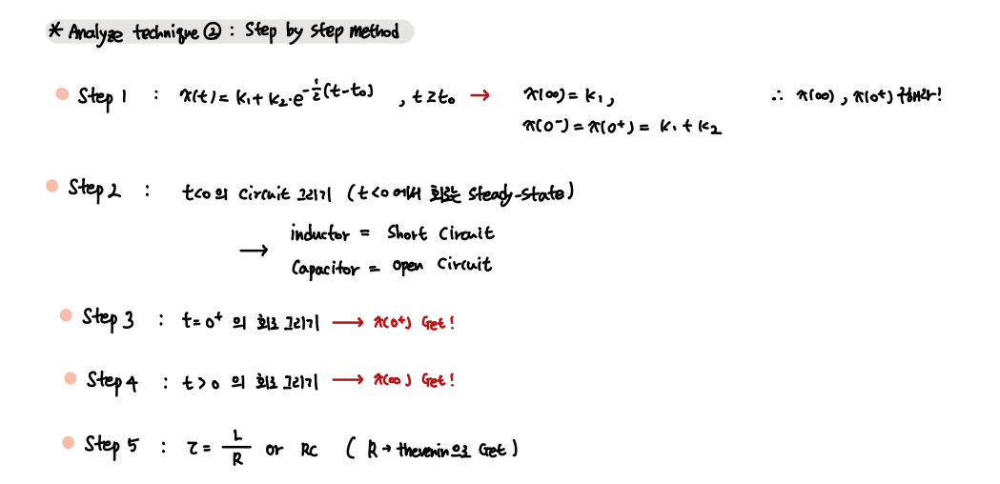

### 1th order circuits

`1차 회로와 2차 회로의 차이는 수동 소자의 개수 차이이다.`

- List

1. What is 1th order circuit?
2. Differenctial Eqn method
3. Step by Step method

 

우리는 우리가 원하는 시점에 회로에 전압 또는 전류를 인가해오고 있다.  
만약 해당 회로에 에너지를 저장하는 소자가 들어있다면, Steady state value를 갖기 까지 잠깐 동안의 Transient Period를 갖는다.

    이 Period 의 행동을 분석하고자 한다.

---

- What is 1th order circuit?

`에너지 저장 소자 1개를 포함한 회로`

 

 

- 미분방정식 풀이

 

- Step by Step 풀이 

 