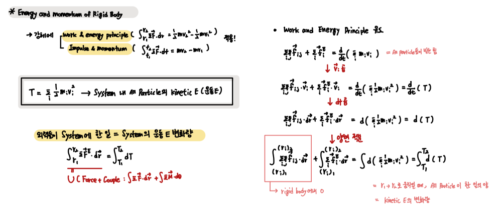
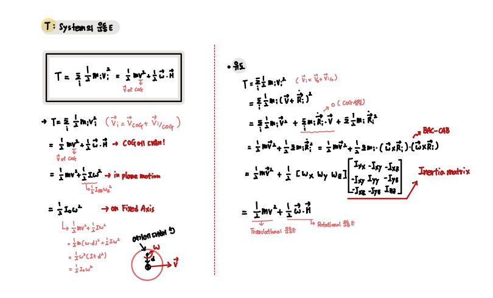
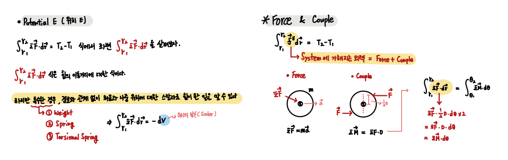
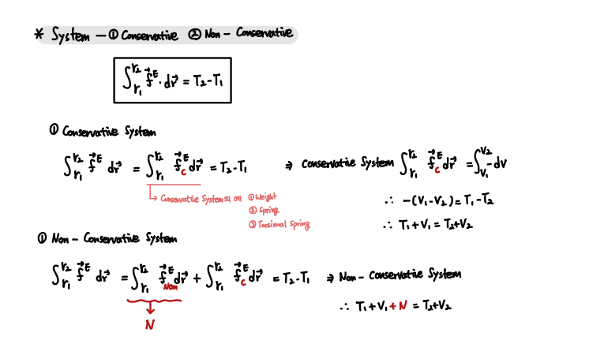
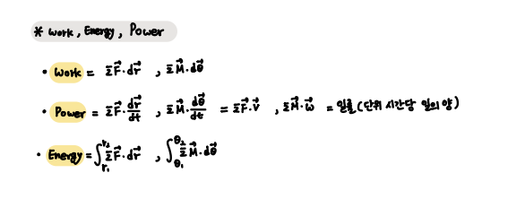
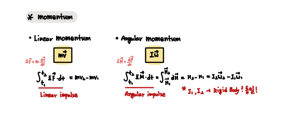

## Energy and Momentum in Rigid Body Dynamics `CH 19`

`운동에 대해 알았으니, 이제 이 운동을 야기시키는 힘에 대해 알아본다.`

- List

1. Work & Energy Principle
2. Potential E , Force & Couple
3. Consevatice , Non-Conservative System 
4. Work , Energy and Power
5. Momentum

 

- Work & Energy Principle

앞서 다뤘던 System의 Kinetic E를 `T`로 정의한다.

`강체에서는 시스템 내부에서의 운동은 0이다.`

`외력들이 System에 한 일은 Force + Couple로 이루어져있다.`

`Work & Energy Principle`을 다시 한 번 유도해보자.

    시스템이 한 위치에서 다음 위치로 움직일 때, 시스템 내의 모든 Particle들이 한 일의 양
    = Kinetic E의 변화량 

 

위에서 정의한 `T`는 `병진 운동에너지, 회전 운동에너지의 합`이다. 

 

- Potential E (위치 에너지) , Force & Couple

 

- Consevatice , Non-Conservative System 

`Conservatice System의 예로는 Weight, Spring, Torsional Spring이 있다.`

 

- Work, Energy and Power 

 

- Momentum

이제 `Angular momentum`에 대해서도 알게 되었다.

