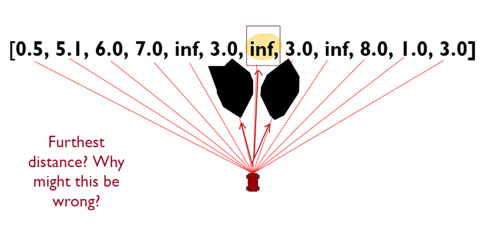
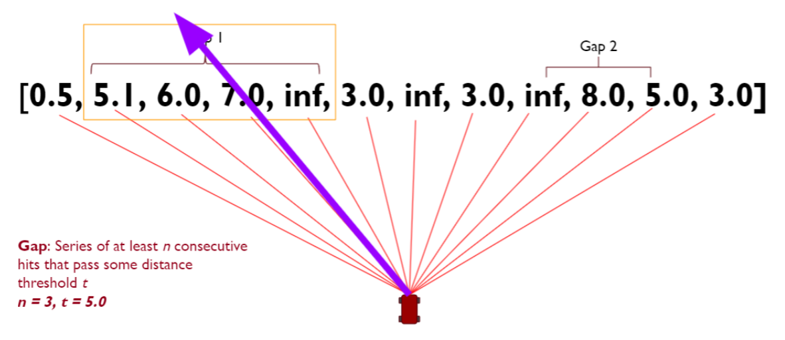
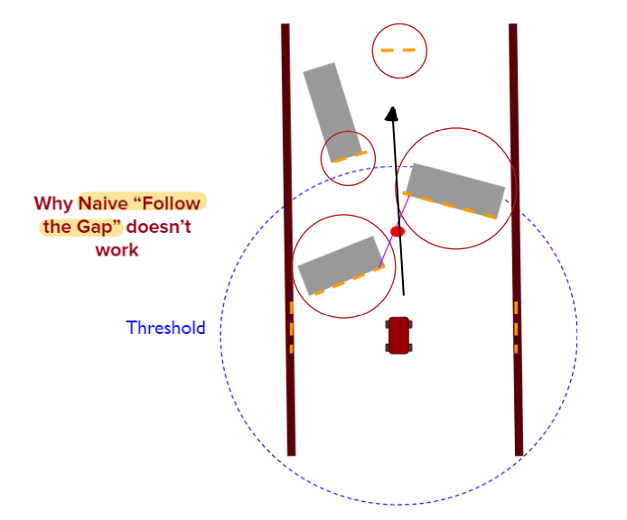
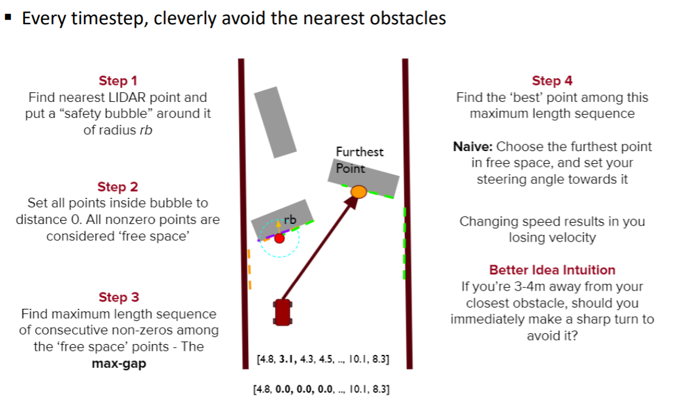

#### Local Path Planning 1 : 'Naive Follow the Gap' & 'Follow the Gap'

2012년에 고안된 알고리즘으로 장애물이 없는 공간을 찾아 주행하는 알고리즘이다.

- `Naive Follow the Gap`

알고리즘은 다음과 같은 아이디어에서 시작한다.

    Lidar Sensor로 스캔한 거리 정보가 주어졌을 때, 가장 거리가 먼 곳을 선택한다.

하지만 위와 같은 경로를 택하는 것이 항상 옳지는 않다. 해당 경로가 가장 안전한 경로는 아니기 때문이다.

따라서 조건을 주어 경로를 택하게 한다.

    Threshold 값을 넘는 적어도 n개의 연속적인 구간을 찾는다. 그리고 그 구간의 최적값(ex: max value)으로 진행한다.

하지만 위와 같은 방법에는 한계가 있었다. 

    1. Robot의 크기를 고려하지 않았다는 점.
    2. 해당 경로가 최적의 안정성을 보장하지 않는 다는 점
    3. Threshold 값을 정하는 것이 어렵다는 점

이 알고리즘을 `Naive Follow the gap`이라고 한다.  

이는 `Holonomic robot`에 대해서는 좋은 선택지이지만, 그렇지 않은 로봇은 다른 방법을 필요로 한다.

    Holonomic Robot : 360도로 움직일 수 있는 로봇 (ex: 사람도 Holonomic)

 

- `Follow the Gap`

  `Follow the Gap`은 이제 가장 넓은 곳을 찾는 것에서 `가장 위험한 곳을 거르는 것`으로 그 목적을 달리한다.

`Follow the Gap Algorithm`

    1. 가장 가까운 Lidar 정보를 찾고, 해당 point에 반경 r의 원을 생성한다. (Safety bubble)
    2. 이 원 안에 존재하는 Lidar Sensing Point 들을 모두 0으로 만들고, 0이 아닌 점들을 free space로 고려한다.
    3. 가장 긴 0이 아닌 값들의 Sequence를 찾는다. (Max-Gap)
    4. 해당 Sequence 내에서 우리가 설정한 최적값을 찾아 경로를 선택한다.

---

 

 

