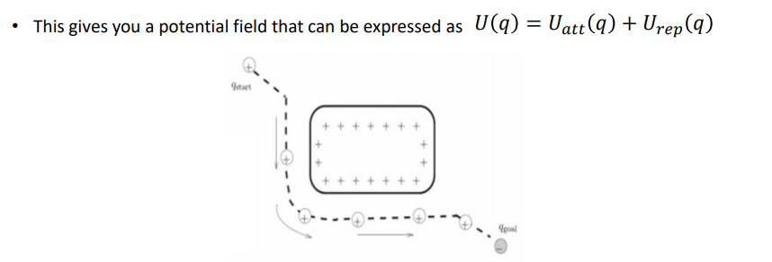
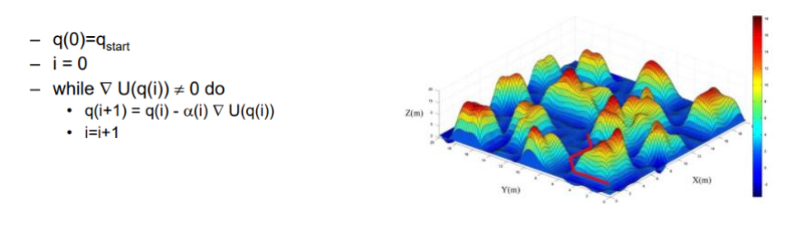

#### Local Path Planning 4 : 'Artificial Potential Fields`

[youtube](https://www.youtube.com/watch?v=UVUTcZisA94)

`Artificial Potential Fields` 는 특이하게 공간을 전자기장과 같이 생각한다.

로봇을 + 극, 목표지점을 - 극으로 하여 서로 인력이 작용하도록 만든다.

또한 장애물을 + 극으로만들어 로봇과는 척력이 작용하도록 한다.

여기서 Potential field function을 정의하는데, 이 함수의 Gradient를 통해 로봇이 주행한다.

Local Map은 로봇이 현재 위치에서 주행하며 그 주변을 Lidar를 통해 매번 생성해낸다.

    하지만 Gradient Descent method를 통해 주행하므로, Local minima에 빠질 위험이 있다.

