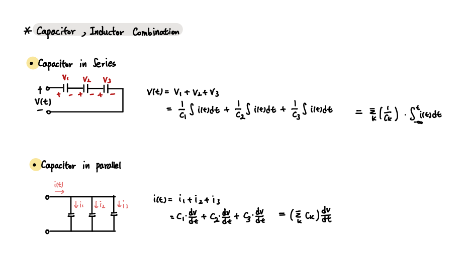

### Capacitance & Inductance

- List 

1. Capacitor
2. Inductor
3. Element Combination 

---

Capacitor와 Inductor는 Resistor와 동일한 수동소자이다.

수동소자 : 에너지를 저장하거나, 소비하는 소자

        Capacitor, Inductor : 에너지 저장
        Resistor : 에너지 발생, 에너지 소모 

 

- Capacitor

`Capacitor에서의 전류와 전압의 관계`

 

- Inductor

`Inductor에서의 전류와 전압의 관계`

 

- Element Combination 

다음 방법을 통해 회로를 보다 더 단순하게 만들 수 있다.

`Capacitor`

`Inductor`

 
