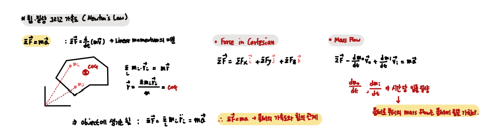

## Force, Mass, Acceleration `Ch 14 - 15`

 

- Force , Mass, Acceleration

`뉴턴의 제 2 법칙은 힘과 가속도 간의 관계를 설명하는 식이다.`

        위 식에서 주의할 것은 System 내의 Particle들의 상대적인 위치가 고정되어 있지 않다는 것이다.
        즉, 강체가 아닌 System에 대한 설명이다.
        
        여기서 모든 Particle들의 질량과 위치를 이용하여 COG를 정의한다.

`뉴턴의 제 2 식에서 말하는 힘과 가속도는 모두 COG에 대한 속성임을 유의해야한다.`

이 후 Angular Momentum에 대해서도 이야기 하겠지만, F = ma 식은 회전에 대한 성질은 설명하지 못한다. 
