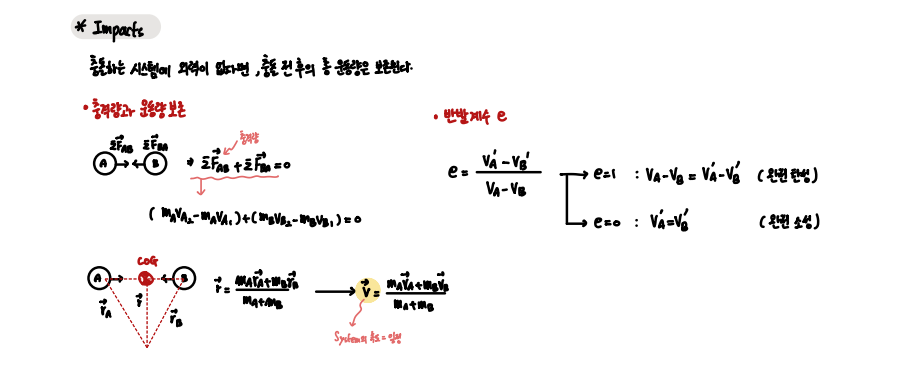

## Energy and Momentum `Ch 15 - 16` 

Ch 15 - 16에서는 F = ma 식으로 부터 다양한 식을 이끌어낸다.

1. Work and Energy
2. Conservative Energy
3. Impulse and (Linear)Momentum
4. Angular Momentum

 

- Work and Energy

`일과 에너지의 관계는 다음과 같이 유도된다.`

`일은 COG에 작용하는 힘의 이동 거리이다, 그리고 일의 변위는 에너지로서 생각할 수 있다.`

 

일과 에너지 식 중 `Weight` 그리고 `Spring` 에너지는 Path가 아니라 변위에 영향을 받는다. 

이 두 힘은 특별히 힘에 따른 물체의 이동 거리가 아니라, `변위`에 대해서만 생각하면 된다.

 

- Conservative Energy

`비보존 에너지가 관여하지 않을 때, 총 에너지는 보존된다.`

 

- Impulse and (Linear)Momentum

Impulse와 선형 운동량에 대한 관계는 다음과 같다.

`COG에 작용하는 단위 시간 힘의 누적합 == 선형 운동량의 변화량 `

또한 일과 에너지 Conservative System과 다음도 성립한다.

`충돌하는 시스템에 외력이 작용하지 않는다면, 충돌 전 후의 총 운동량은 보존된다.`

여기서 `반발계수 e`를 알면 해당 충돌의 속성이나, 충돌 전 후의 속도 변화를 알 수 있다.

 

- Angular Momentum

`Angular Momentum은 각 운동량으로 이를 통해 물체의 회전에 대한 속성을 알 수 있다.`

