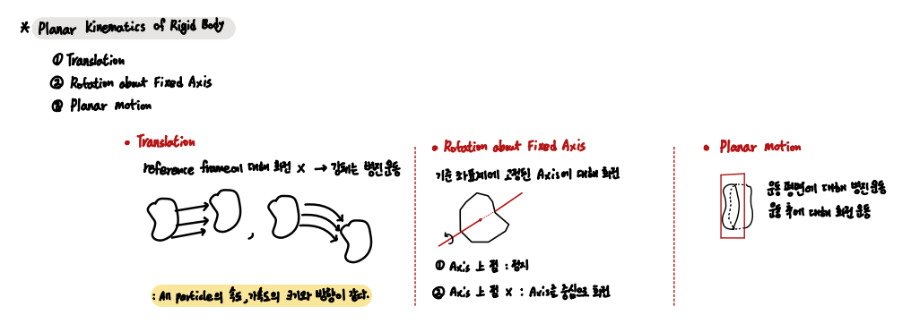
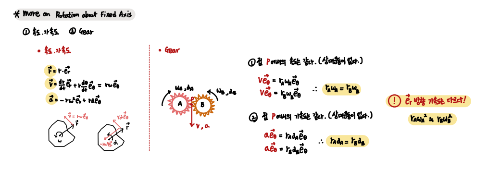
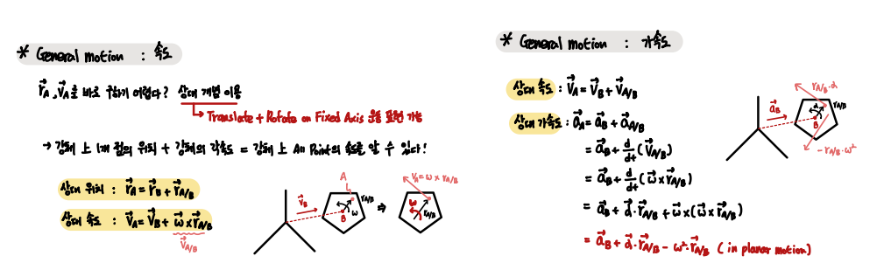
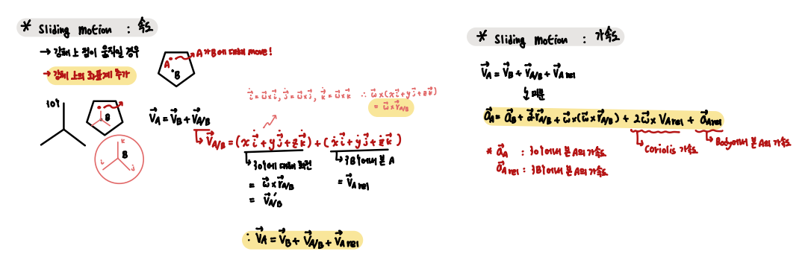

## Planar Kinematics of Rigid Body `ch 17`

- List 

1. `강체의 평면 운동`
2. `고정 축을 중심으로 도는 강체`
3. `General Motion`
4. `Sliding Motion`

 

- 강체의 평면 운동

총 3가지 형태의 운동이 있다.

    1. Translation
    2. Rotation
    3. General Planar Motion (translate + rotate)

 

- 고정 축을 중심으로 도는 강체

`강체 위의 한 점에서의 속도는 기준 점에 대한 상대 속도로 표현할 수 있다.`  

또한 Gear를 다룰 때에 많이 사용되는 개념으로, 꼭 기억하는 것이 좋다.

        Geared motor control에 사용하는 개념

 

- General motion

`회전하고 병진 운동을 동시에 하는 강체 위의 한 점의 위치와 속도를 상대 개념을 이용한다.`

    강체 위의 고정된 한 점의 속도와 가속도

    강체 위의 고정되지 않은 한 점의 속도와 가속도

`Relative term` 을 추가한다. 

`강체 위의 한 점에 대한 위치, 속도 그리고 가속도는 기준 좌표계에 따라 다르게 정의할 수 있음에 주의한다.`

