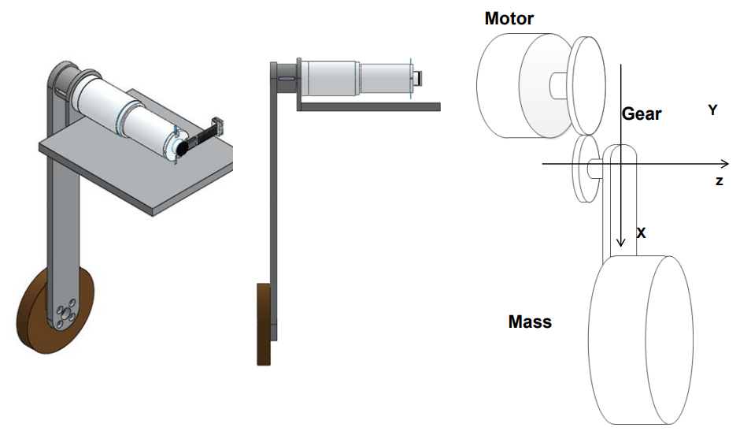
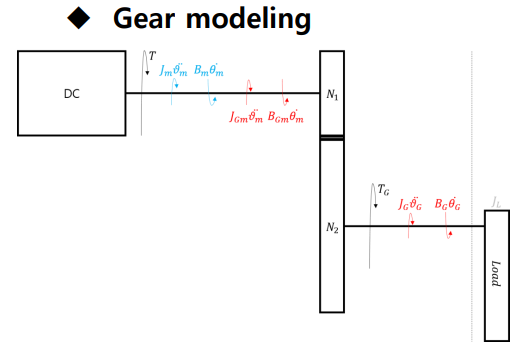
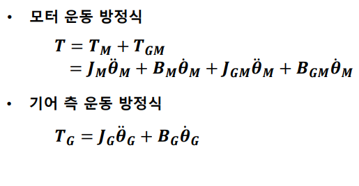
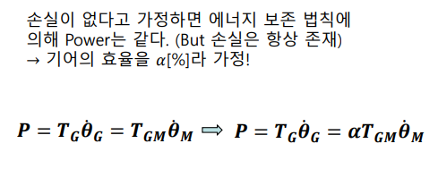
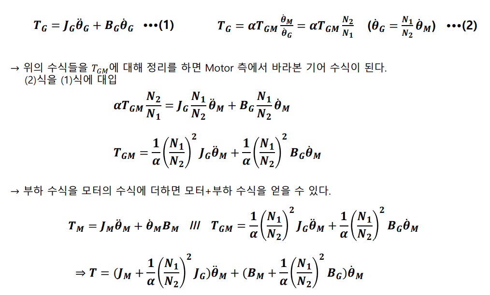
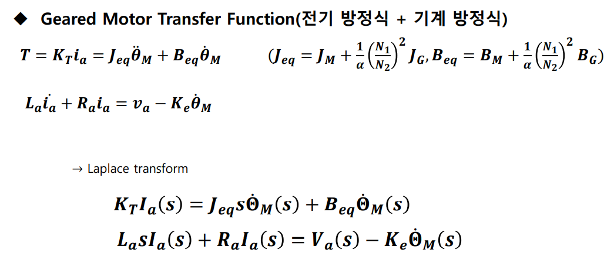
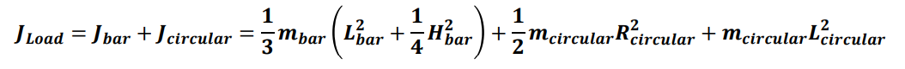
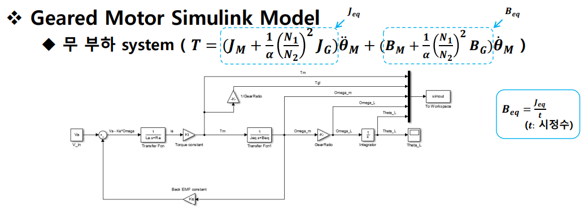
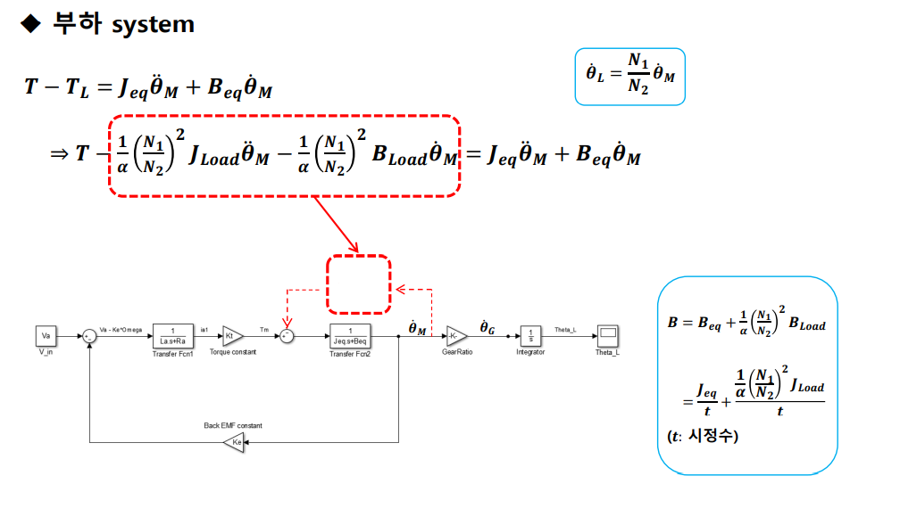

## Geared Motor 

`2 자유도 로봇 팔을 제어하기 앞서 1 자유도 팔을 설계하는 방법을 알아본다.`

 

- Geared motor modeling for 1 Link Robot arm

내부적으로 모터와 Gear가 맞물려 있으며, Load로 긴 판과 원 판이 달려있다.

 

- Geared Motor Modeling

다음과 같이 간략히 모델링하여, 모터의 `기계 방정식`을 알 수 있다.  
전기 방정식은 달라지지 않았으므로 그대로 사용한다.

 

    Gear 없이 모터 단독으로 도는 경우 T = Tm

    Gear가 붙게 되면 T = Tm + Tgm

        Tgm : 기어가 달리면서 추가적으로 필요하게 되는 Torque

 

`우리는 Jm, Bm과 Jg, Bg를 알고, Jgm, Bgm는 알지 못한다.`

따라서 부하 측 운동 방정식을 모터 측에서 본 기계 방정식으로 변환한다.

이를 통해 모터 측에서 바라본 전체 기계 방정식을 얻을 수 있다. 

 

- 모터 측 기계 방정식 

`P = 힘 * 속도`  

 

 

`기계 방정식 + 전기 방정식`

 

이제 해당 모터에 부하를 달아서 전체 시스템을 모델링 해보자.

부하는 Z 축에 대해 `평행축 정리`를 사용하여 원판과 팔의 Inertia를 Z 축에 가져와 합쳐준다.

 

- 무 부하 시스템

 

- 부하 시스템

