### Motor Control

궁극적으로 우리가 제어할 것은 위치이므로, 모터의 토크를 제어해야한다. (모터의 토크 제어 = 전류 제어)

최종적으로 제어할 것은 모터의 위치이며, 위치를 제어하기 위해서는 속도를 제어해야하고, 속도를 제어하기 위해 전류를 제어해야한다.

 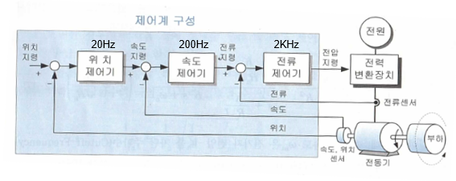

전류 제어, 속도 제어, 위치 제어를 Cascade 구조로 해서 제어기를 설계한다.

    전류 제어기의 Bandwidth가 가장 넓어야한다. 즉, 가장 빠른 반응속도를 가져야한다.

    속도 제어기는 전류 제어기의 10배, 그리고 위치 제어기는 속도 제어기의 10배를 가지면 된다.

 

#### 제어기 설계시 고려 항목

1. 안정성
2. 속응성
3. 정상 상태 오차

- 안정성

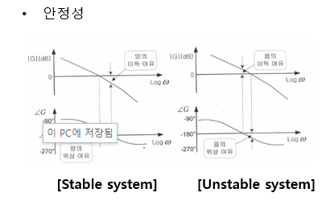

`Gain margin`  : 2 ~ 10 dB 정도면 ok  
`Phase margin` : 30 ~ 60 degree 정도면 ok

 

`Gain margin의 의미`

**Phase margin이 -180일 때, Gain이 0 dB 보다 작다면 안정적이다.**

    Phase margin이 -180이라는 얘기는 입력 신호에 대해 정반대의 위상의 신호가 나온다는 얘기다.

    즉, Sin(x) -> Sin(PI - x) = -Sinx 

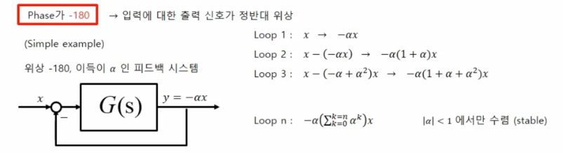

**따라서 Phase가 -180일 때, Gain이 0dB 보다 작다면 즉, 값이 1보다 작다면 수렴한다.**

    Gain margin의 의미는 바로 이것이었다!

---

 

- 속응성 : 시스템이 입력에 대해 얼마나 빨리 반응하는가?

`속응성은 대역폭에 비례한다.`

 

`대역폭` : 입력 신호를 재생할 수 있는 능력 

        Gain이 -3dB가 되는 곳이 Bandwidth 주파수 

주파수가 느린 입력을 주면 시스템이 따라갈 시간이 충분하다.(곧 잘 따라간다)

하지만 점점 빠른 주파수를 가진 입력을 넣어주면, 시스템이 입력을 바로 잘 못 쫒아가고 점점 쳐진다.

**이 때, 입력을 잘 쫒아가는 주파수 까지가 바로 대역폭 Bandwidth이다.**

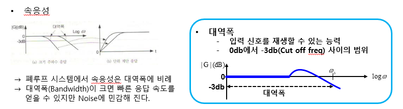

 

`주파수 대역이 높다는 것은 무엇을 의미하나?`

더 넓은 주파수 대역에 대해서 시스템이 입력 신호를 잘 따라갈 수 있다는 의미이다.

    즉, 우리가 더 빠른 주파수를 넣어서 제어를 수행할 수 있다는 의미!

    다시 말해서 빠른 주파수를 넣어서 응답속도를 빠르게 가져갈 수 있다는 것이다.

대역폭을 넓게 가져가는 것에 대해 한 가지 단점이 있다면, 바로 `노이즈에 민감해진다는 것`이다.

노이즈는 보통 고주파 성분을 갖는데, 대역폭을 넓게 하여 고주파 신호를 사용하게 되면 이 고주파 노이즈도 고스란히 섞여들어가게 된다.

---

 

- 정상 상태 오차 

시스템의 제어 대상 값이 최종 값에 도달하고 난 후의 입력 값에 대한 오차

 

정상 상태 오차는 최종값 정리를 이용해서 알아볼 수 있다.

최종값 정리는 시간을 무한대로 보냈을 때, 시스템이 어떤 특성을 보이는 지를 살펴보는 것이다.

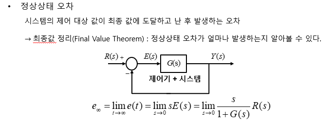

---

 

#### 제어기 설계

1. 전류 제어기
2. 속도 제어기
3. 위치 제어기

 

- PID 제어

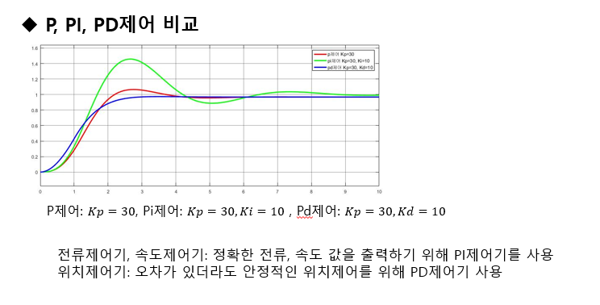

`P  제어` : 속응성이 빠르지만 정상 상태 오차가 존재한다.  
`PI 제어` : 정상상태 오차를 줄일 수 있지만 오버슈트가 증가한다.  
`PD 제어` : 오버슈트가 줄고, 외란에 강하지만 정상상태 오차가 존재한다.  

    전류, 속도 제어기 : 정확한 속도와 전류를 넘겨주어야 하기 때문에 정상상태 오차를 최대한 줄이는 `PI 제어`를 사용한다.  
    위치 제어기 : `PD 제어`를 사용 

 

- 전류 제어기 설계

전류 제어기는 지령 전류를 입력으로 받고, 모터의 출력 전류를 feedback 받는다. 이후 전압 지령을 출력한다.  
이 전압 지령이 모터로 넘어가 모터가 움직이게 된다. 

전류 제어기 만을 떼어서 보았을 때, back emf에 대한 값이 disturbance로 취급된다.

`이를 제거하기 위해 전향보상을 수행한다.`

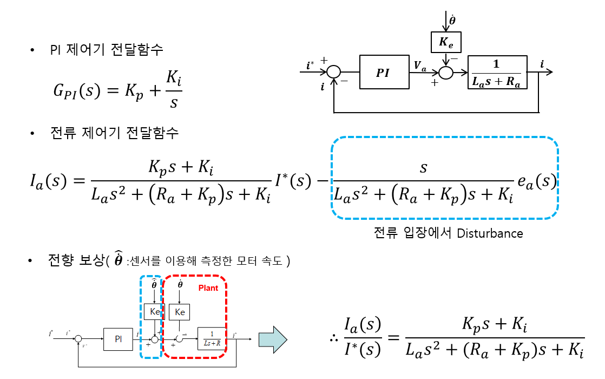

 

- Pole-Zero Cancelation

불안정한 Pole을 가진 Plant에 대해 이를 상쇄하는 Zero를 가진 제어기를 달아 안정한 시스템을 만드는 방법이다.

하지만 여기서는 전달함수의 차수를 줄여 시스템을 단순하게 만드는 데에 사용된다. 

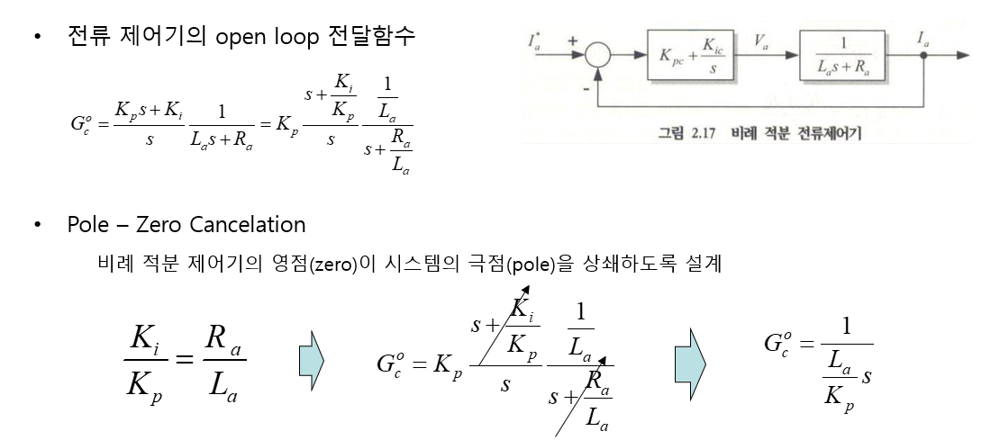

 

    여기서 Open Loop 전달함수를 살펴보는 것은 Bode plot과 Nyquist plot 모두 Open loop 전달함수를 통해 안정성을 검사하기 때문이다.

전류 제어기의 open loop 전달함수에 대한 Bode plot을 그려보면 다음과 같다.

    여기서 이 전달함수의 Phase는 항상 -90도이다.

    따라서 이 때의 Gain margin이 0dB라면 안정 상태임을 확인할 수 있다. 

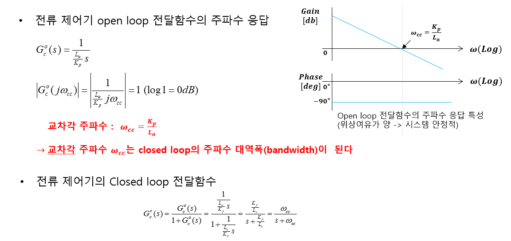

전달함수의 분모를 1로 만들어 0dB를 만드는 주파수 `Wcc`를 `교차각 주파수`라 한다. 

 

**이제 위 교차각 주파수 조건과 Pole-Zero Cancelation 조건 두 가지를 이용해서 PI gain을 찾을 수 있다.**

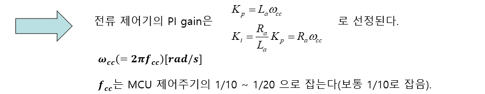

 

- Anti-Windup

전류 제어기를 구성할 때 출력으로 특정 전압를 넘지 않도록 리미터를 넣어 준다.

    모터의 정격 전압을 넘어가면 모터에 불이 난다.

        전류 제어기는 출력으로 전압 지령을 넘겨준다. 까먹지 말자. 

여기서 리미터를 걸게 되면 오차가 누적된다. `이 오차를 제거하기 위해 Anti-Windup을 사용한다.`

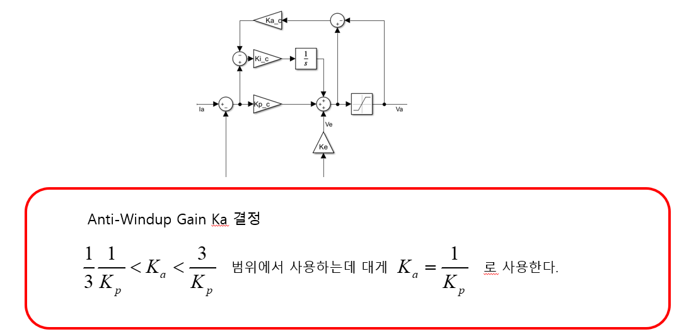

 

- 속도 제어기

속도 제어기도 전류 제어기와 마찬가지로 설계한다.

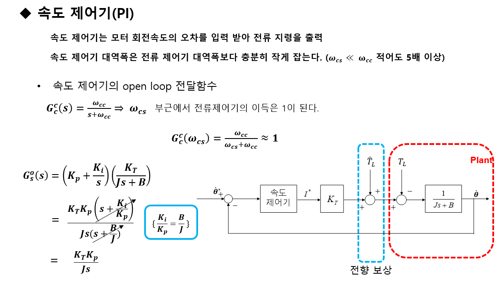

 

- 위치 제어기

위치 제어기도 속도, 전류 제어기와 마찬가지로 설계한다.

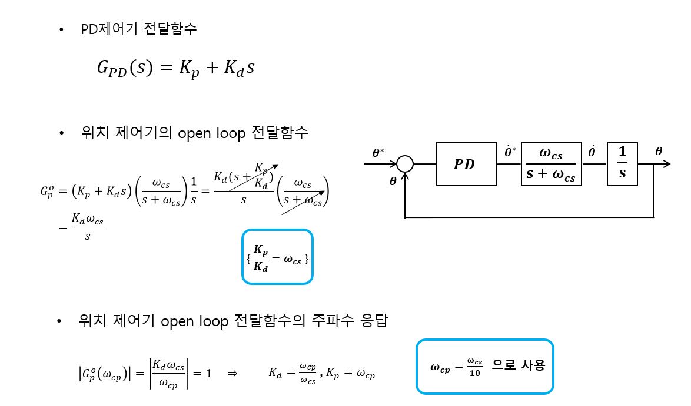

