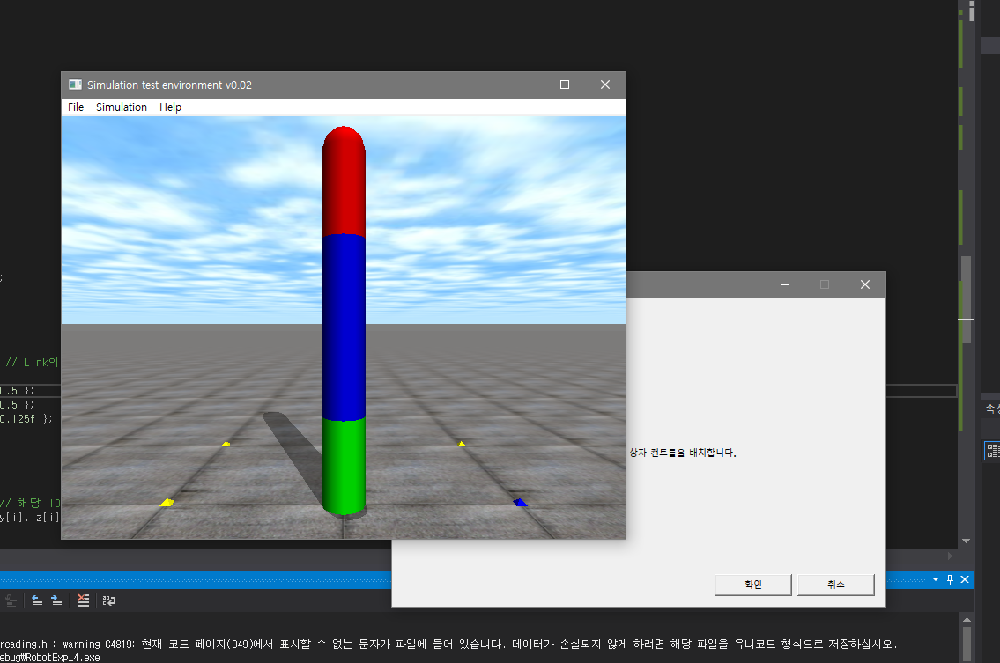
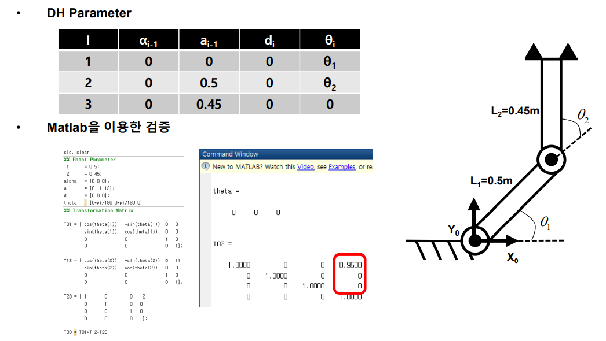
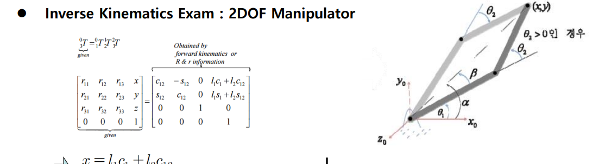
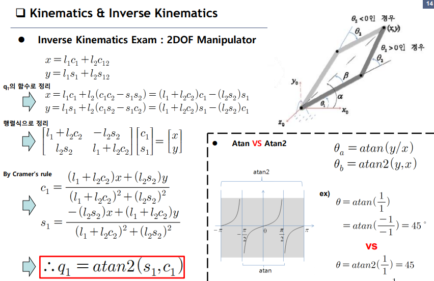

#### Kinematics

간단한 ODE 사용결과와 Forward Kinematics, Inverse Kinematics

- Forward Kinematics

       Joint Variable을 통해 End-Effetor의 위치와 방향을 구하는 문제

- Inverse Kinematics

       End-Effector의 위치와 방향을 통해 Joint Variable들을 구하는 문제
        
           - 해가 하나가 아닐 수도 있고, 존재하지 않을 수도 있다.

- Virtual Robot Experiment with ODE

---

- Forward Kinematics

       1. DH Parameter를 통해 각 Link Parameter를 구한다.
       2. Link parameter로 구성된 Transformation matrix를 구한다.
       3. Do Compount Arithmatic with Transformatin matrix
       4. End-Effector의 위치와 방향 Get

- Inverse Kinematics

       1. Given Matrix와 Transformation matrix의 Compound Arithmatic을 통해 구한 결과를 비교한다.
       2. Position Vector는 방향 성분에 들어있는 각도와 독립이므로, 위치 벡터로부터 시작한다.
       3. Robot에 따라 여러가지 방법이 있다.
  
        - Robot Kinematics에서와 Robot experiment4에서 사용하는 방법이 조금 다르다.
       

 

로봇학 실험4 수업에서는 두 번째 theta를 `Cramer's rule`을 통해 구했다. 이 방법도 유용하다.

