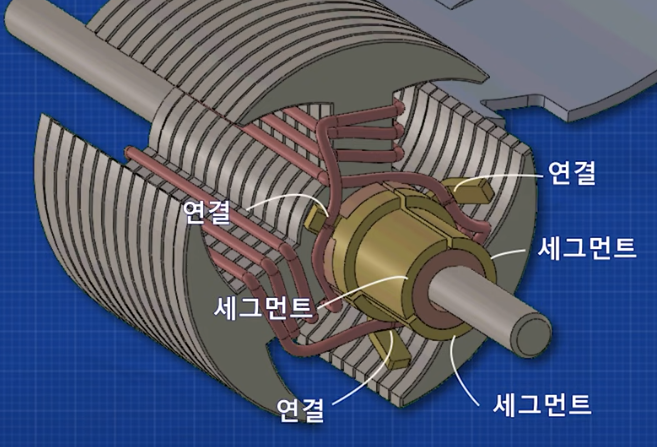
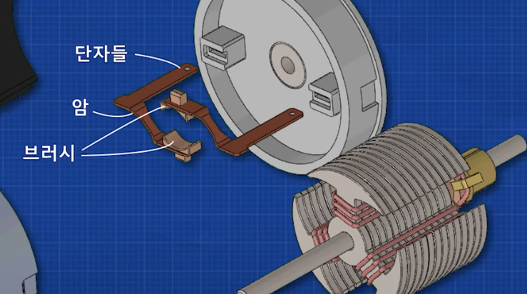
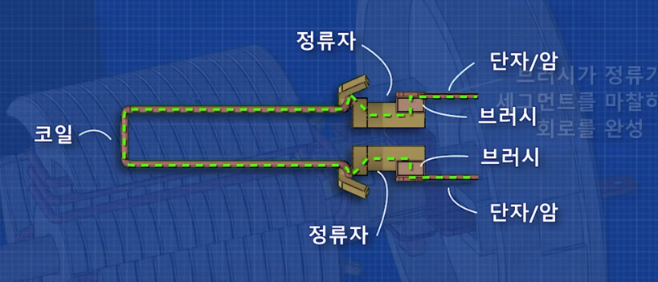
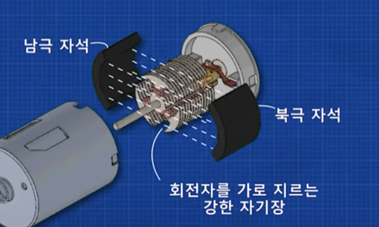
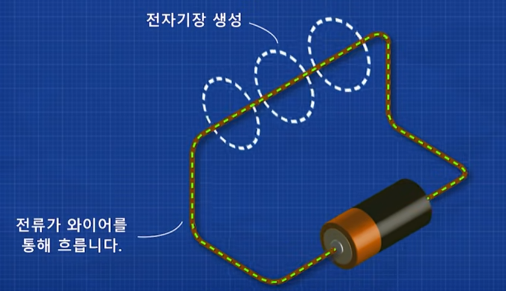
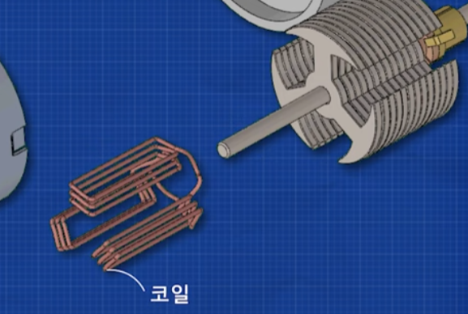
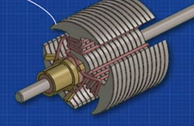
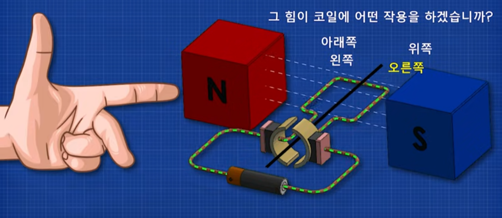
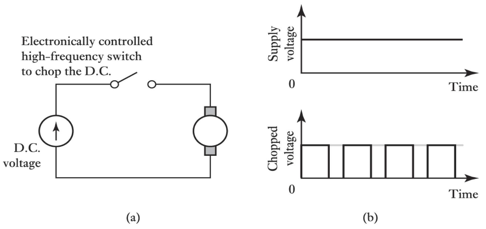

### `About DC Motor`

- DC motor : 전기 에너지를 기계 에너지로 바꾸기 위해 사용

       DC : 전류의 흐름의 방향이 단방향
       AC : 전류의 흐름의 방향이 양방향

---

- `정류자와 코일` 

1. 정류기는 각 플레이트마다 전기적으로 격리되어있다.
2. 각 코일의 끝은 서로 다른 정류기의 플레이트에 연결된다.
3. 양극 단자와 음극 단자를 한 쌍의 정류자 플레이트에 연결하면, 전류를 흘려보낼 수 있다.
        
          A 플레이트 -> 코일 -> A* 플레이트 (A-A* : 플레이트 쌍)

          해당하는 플레이트에 연결된 코일은 다른 코일과 전기적으로 격리되어있으므로 하나의 회로를 구성한다.

 

- `정류자와 브러쉬`

뒷 쪽 케이스를 보면 브러시와 브러시 암 그리고 단자가 있는데, 이 단자에 전극을 붙여 전류를 흘린다.

정류자의 플레이트는 이 브러시 사이에 위치하고 붙어서 회로를 구성한다.

브러시를 통해 전류가 들어오고, 이 전류는 정류자의 각 플레이트를 통해 코일로 흘러들어간다.

 
 
 

- `자기장`

영구 자석을 통해 회전자를 가로지르는 강한 자기장을 형성시켜준다.  
로렌츠 힘을 발생시키기 위한 조건으로 자기장이 필수적이다.

    이 때, 자기장을 만드는 방법으로 영구 자석을 사용하는 방법과, 회전자 주위에 코일을 감아 전류를 흘리는 방식으로 자기장을 만드는 방법이 있다.

`자기장 생성 Method 1`

`자기장 생성 Method 2`

 

- `DC 모터의 회전과 회전자 (로터)`

        회전자? 코일? 회전자의 팔에 코일을 감아서 전류를 흘리는 것. 혼동하지말자!

 

회전자가 회전하면 브러쉬에 닿는 플레이트가 계속 바뀌게 된다.

이에 따라 전류가 흐르는 코일이 주기적으로 바뀌게 되며, 이를 통해 힘의 방향을 일정하게 유지할 수 있게 된다. 

        현재 위 그림을 기준으로 왼쪽 플레이트에 닿은 코일은 우리에게서 멀어지는 쪽으로 전류가 흐른다.
        
        반대쪽 방향의 코일에서는 전류가 우리 쪽으로 다가오는 방향이다.
        
        하지만 회전자가 회전하면서 왼쪽에 있던 플레이트가 반대쪽 브러쉬에 닿게 된다.

        이제 왼쪽으로 붙어버린 플레이트에 닿은 코일을 보면, 전류가 다가오는 쪽으로 바뀌었다.

        결과적으로 모터가 계속 한 방향으로 흐를 수 있게 된 것이다!

 

회전자 코일 세트가 많을 수록, 회전이 부드러워진다.

이는 코일 또는 회전자가 정 중앙에 위치할 때, 순간적으로 힘이 0이 되는 지점이 있게 되기 때문이다.

 

- `Control DC Motor`

DC Input이 일정하다고 할 때, PWM을 이용해서 DC 모터의 속도를 제어한다.

