### Jacobian 

Jacobian은 수학적으로는 `편미분 행렬`이다.

로봇에서의 Jacobian의 쓰임은 다음과 같다.

    1. 말단부의 속도와 Joint 변수들의 속도 관계

        - 말단부의 위치 x가 이만큼의 속도로 움직일 때, 각 Joint 변수들이 얼마나 기여하나?
        - Joint 변수들을 얼마나 움직여야 말단부의 위치 x가 요만큼 속도로 변하나?
        
    2. 말단부의 힘과 Joint 변수들의 토크 관계  
        - Joint 들에 요만큼의 토크를 주면 말단부한테 이만큼의 힘을 줄 수 있다~
        - 말단부에 요만큼의 힘을 주려면 Joint들에 이만큼의 힘을 줘야한다~

 

 

#### 말단부와 Joint의 속도 관계 

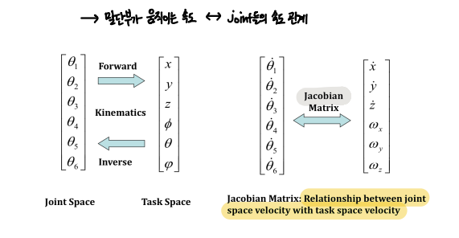

 

도대체 Jacobian이 뭔지 살펴보자.

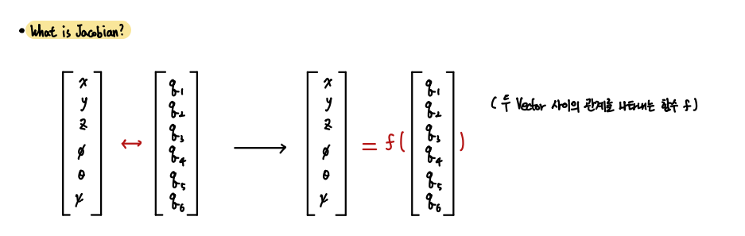

Forward 또는 Inverse Kinematics를 통해 말단부의 위치와 방향과 Joint 변수들의 관계를 오고 갈 수 있다.

따라서 이 두 변수들 간에는 일종의 선형 변환 방정식이 존재한다.

    Ex) 말단부위치 x 는 joint 변수들 q1, q2, q3, ...의 변수들로 이루어진 어떤 함수 f에 의해 얻어진다.

            x = f(q1, q2, q3, ..)

 

따라서 위의 왼쪽 그림과 아래 그림과 같이 `말단부의 위치,방향과 Joint 변수들 사이의 등식을 만들 수 있다.`

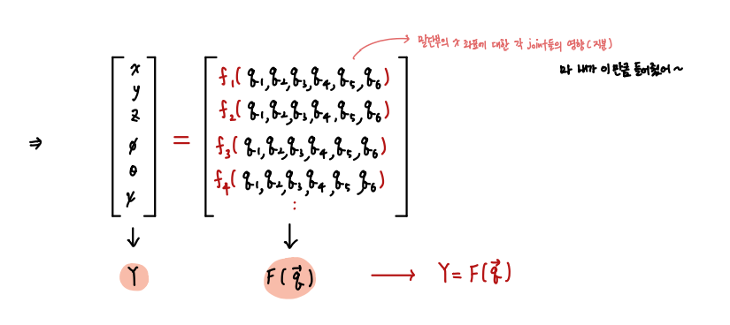

 

이제 이 등식의 양변을 미분해보자.

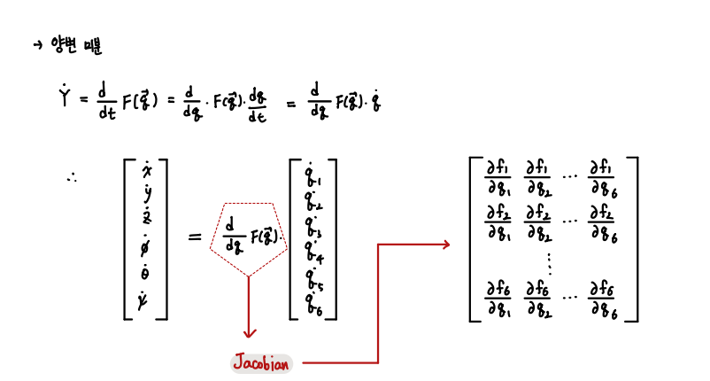

이 미분을 통해서 우리는 Jacobian을 구할 수 있다.

이 방정식에서의 Jacobian의 역할 또는 의미를 살펴보자. 

    이를 통해 조금 더 직관적으로 이해할 수 있다.

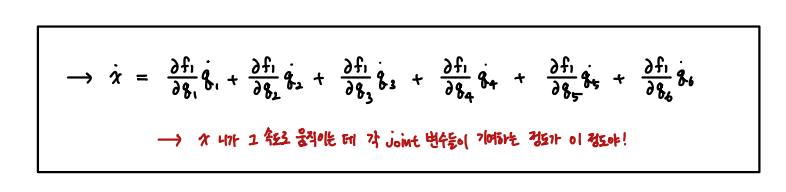

즉, x위치가 어떠한 속도로 움직일 때, 각 Joint 변수들이 얼마나 기여하고 있는 지를 알려주는 행렬인 것이다.

 

 

#### 말단부의 각속도 성분  

우리는 지금 말단부의 위치와 방향에 대한 속도를 알아보고 있다.

선속도에 해당하는 x, y, z의 속도는 단순히 미분해서 얻을 수 있다.

하지만 각속도에 해당하는 요소들은 단순 미분으로 구할 수 없다. 이는 `회전속도 벡터(Omega)로 규명되고 있기 때문이다.`

Forward Kinematic를 통해 말단부의 위치와 방향을 얻었다.

말단부의 표현에선 위치 성분은 그대로 x, y, z로 표현했지만, 방향 성분은 Roll Pitch Yaw로 바꿔서 표현했던 것을 기억하자.

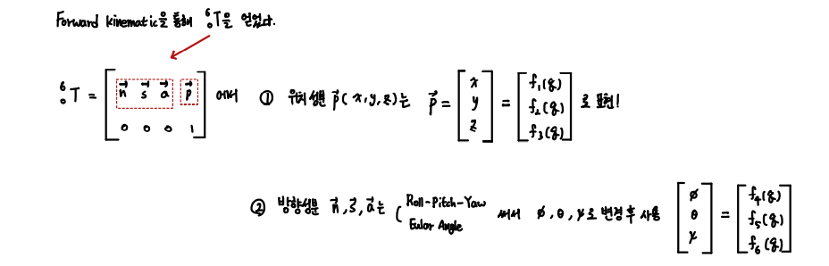

 

이제 미분을 통해 위치 성분과 방향 성분의 속도들을 구하려고 한다.

하지만 위에서 말했 듯, 방향 성분의 속도는 회전속도 벡터로써 표현되고 있으므로 단순 미분이 불가능하다.

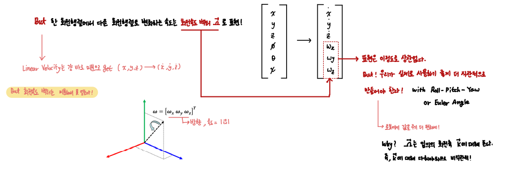

회전 속도 벡터는 x 방향, y방향, z방향 성분을 가지고 있고, 해당 벡터의 크기의 속도로 회전하고 있다.

사실 말단부의 표현은 그냥 회전속도 벡터 Wx, Wy, Wz로 해도 상관없다.

    하지만 우리는 로봇에 명령을 넣어야 하기 때문에 조금 더 직관적인 표현법이 필요하다.
    따라서 여기서도 Roll Pitch Yaw 또는 Euler Angle을 통한 표현으로 바꾼다.

**이제, 회전 속도는 x 축에 대해서 얼마의 속도.. y 축에 대해서 얼마의 속도... 와 같이 직관적으로 명령을 내릴 수 있다!**

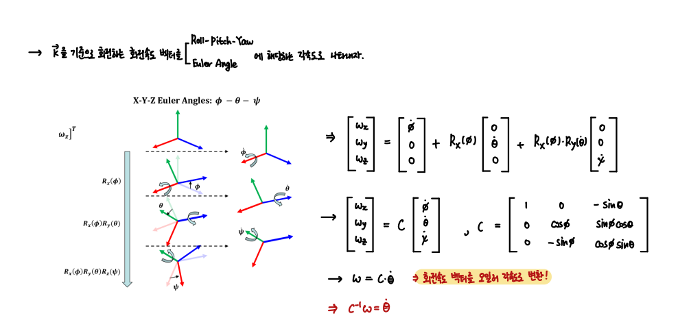

즉, 임의의 축에 대해 회전하던 회전 속도 벡터를 기존 축에 대한 회전 속도로 바꾸어 표현한 것이다.

    K 축 -> x, y`, z` 축 (Euler axis) 또는 x, y, z 축 (fixed axis)

 

 

#### 말단부의 Joint의 힘, 토크 관계

각 Joint들이 한 일과 말단부가 한 일은 보존된다. 

    일 : 힘 x 이동거리

따라서 다음과 같은 수식이 성립하고 이를 통해 힘과 토크의 관계를 얻어낼 수 있다.

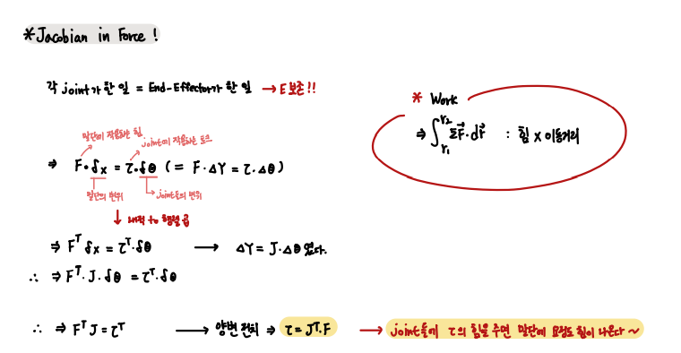

이 관계식을 통해 Joint에 어느 정도의 힘을 주어야 우리가 원하는 힘을 얻을 수 있는지 알아낼 수 있다.

 

 

#### Jacobian의 사용

1. Jacobian은 말단부의 속도와 Joint 변수들의 속도 간의 관계를 규명한다.
2. Jacobian은 말단부의 힘과 Joint 변수들의 토크 간의 관계를 규명한다.
3. Jacobian의 역을 통해 Inverse Kinematics를 수행할 수 있다.

 

특히 3번에 대해서는 유용하게 쓰일 수 있다.  
만일 우리가 말단부의 위치와 방향이 얼마나 변했는 지를 알고, Jacobian을 안다면 간단히 역기구학의 해를 구할 수 있다. 

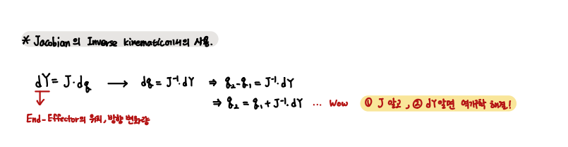

 

 

#### Singularity

로봇에서의 특이점은 무조건 피해야한다.

1. Jacobian의 Rank < Full Rank일 때
2. Jacobian이 Non-Invertible할 때 (determinant = 0)
3. Boundary Singularity
4. Interior Singularity

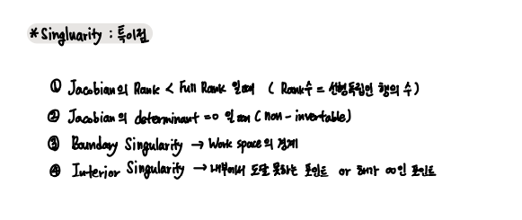

 