### `About AC Motor`

- 3 Phase AC Motor : 3상 AC 전류로 구동되는 전기모터

- List 

      고정자
      회전자
      회전 원리

---

- `고정자 (Stator)`

하우징 내부에는 고정자가 존재하며 이름 그대로 회전하지 않는다.

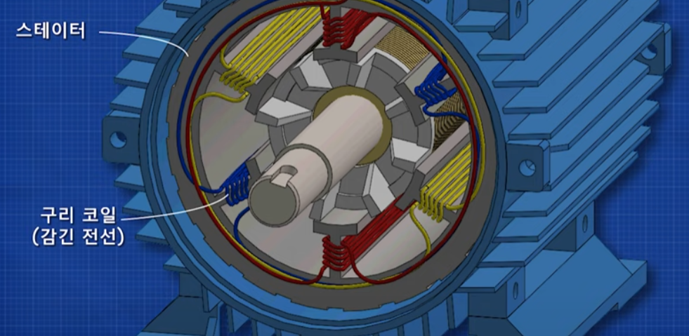

 

고정자에는 3개의 서로 분리된 전선 세트가 있다. 

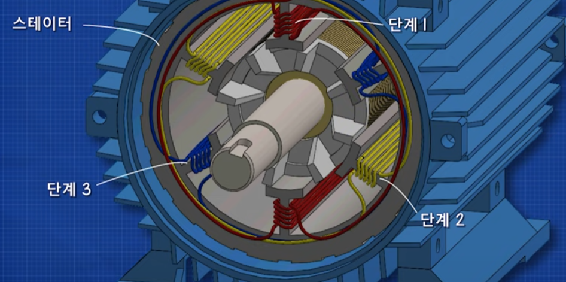

 

각 전선 세트의 끝은 전기 단자 상자 내부의 단자에 연결된다.

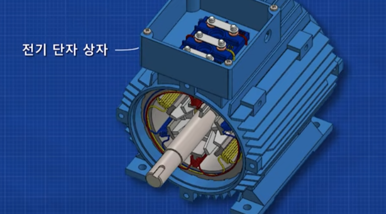

  

고정자의 감긴 전선은 `회전하는 전자기장을 생성`한다. 

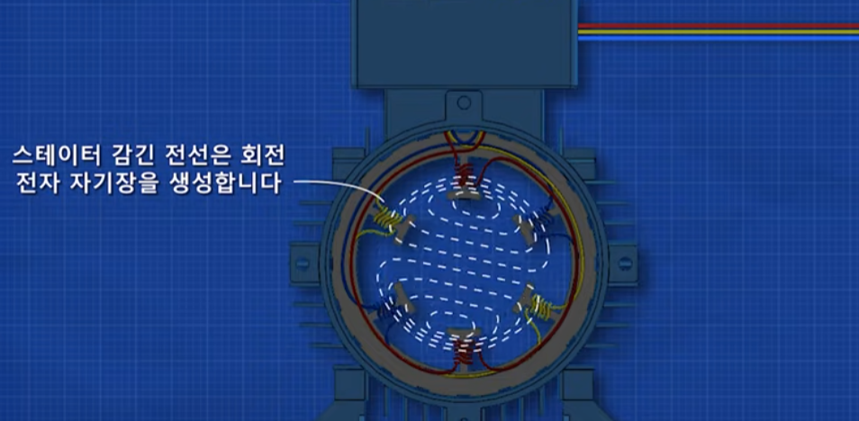

 

 

- `회전자 (로터)`

회전자는 고정자 내부에 위치한다.

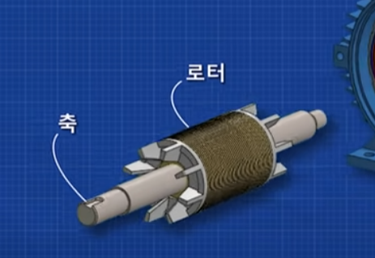

로터는 스쿼럴 케이지 로터를 사용한다.

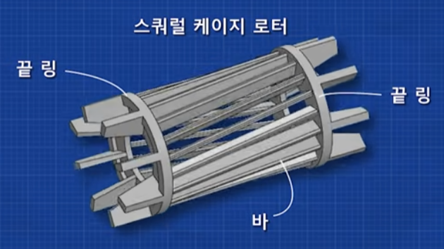

스쿼럴 케이지 로터는 막대로 연결된 두 개의 끝 꼬리가 있고, 함께 회전한다.  

여기에는 아주 많은 적층 라미네이트 강판이 있는데, 이는 자기장을 크게 집중시키는데 도움을 준다. 

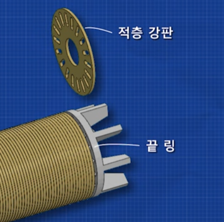

 

고정자에 전원이 공급되면 로터가 회전한다.

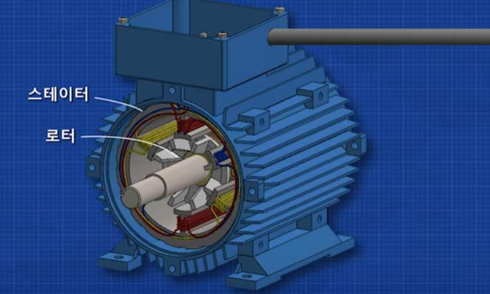

 

- `회전 원리`

우리는 자석 주변의 자기장의 강도를 조절하며 중앙의 자석을 회전시킬 수 있다.

        이는 BLDC 모터의 원리를 생각하면 이해하기 쉽다.

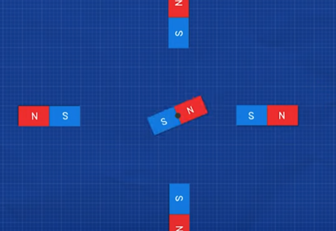

 

우리가 전선을 코일을 감아 전류를 흘리면 전자기장이 강해진다. 

코일은 이 때 영구자석처럼 N극과 S극을 만든다.

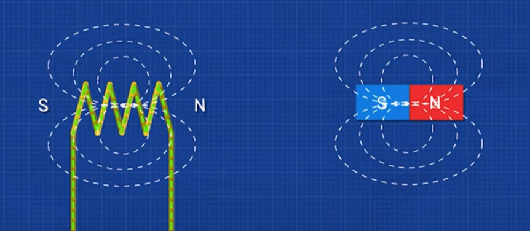
 
이 전선의 코일을 `Inductor` 라고 한다.

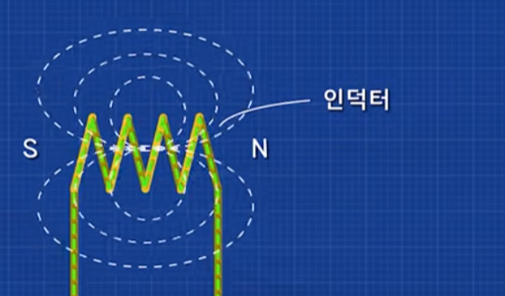

 

전선에 교류 전류를 넣어주게 되면, Inductor의 자기장이 팽창하고 붕괴되는 것을 반복한다.

이때 극성이 계속 뒤바뀐다. 

        AC의 Sin파를 생각하면 Amplitude가 계속 변화하는 것을 이해할 수 있다. 

        따라서 자기장이 커졌다 작아졌다를 반복하는 동시에, 극성의 방향도 주기적으로 변한다. 

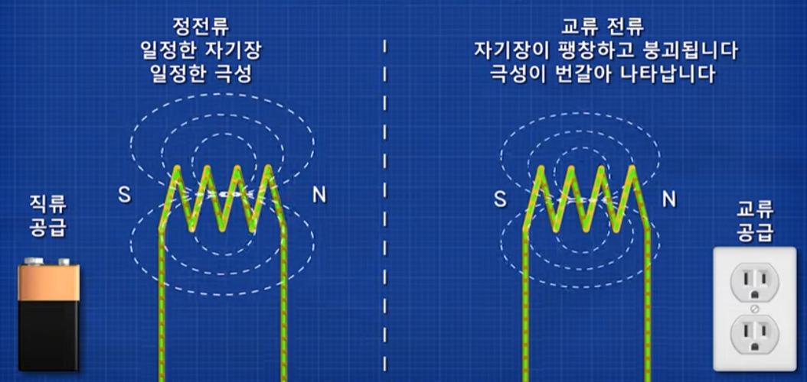

 

변화하는 전자기장에 다른 도체를 대면 전류가 흐른다는 것을 안다. (유도 전류)

하나의 전선을 다음 그림과 같이 반대편으로 위치시키면 더 큰 자기장을 생성할 수 있다고 한다.

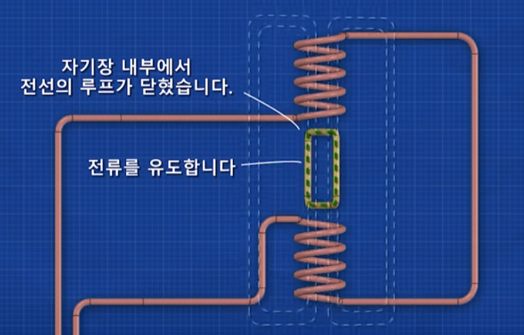

이 때 두 Inductor 사이에 전선을 위치시키면 전류가 유도된다.

        이는 AC 전류이기에 가능한 것이다.

 

가운데 전선에 전류가 흐르게 되면, 이 전선 또한 자기장을 생성할 것이다. 

이 가운데 전선은 코일이 유도한 자기장 내에 위치해있고, 또한 전류가 흐르므로 로렌츠 힘이 작용한다.

따라서 다음과 같이 전선이 회전하게 된다.

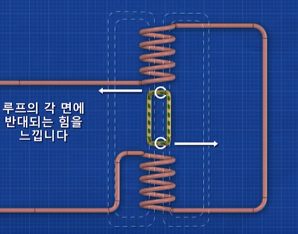

 

`이 회전하는 전선이 바로 회전자이고, 우리가 AC 전류를 넣어주는 코일(Inductor)이 감긴 전선이 바로 고정자이다.`  

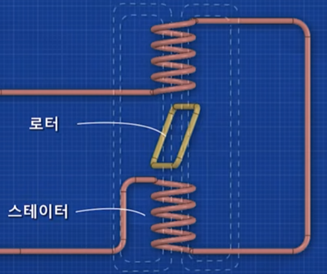

 

DC Motor에서와 같이 회전자는 자기장이 서로 정렬될 때 로렌츠 힘이 0이된다. 

    여기서는 DC 모터의 정류자와 같이 회전을 시켜주는 장치가 없기 때문에 이 상태에서 고착된다.

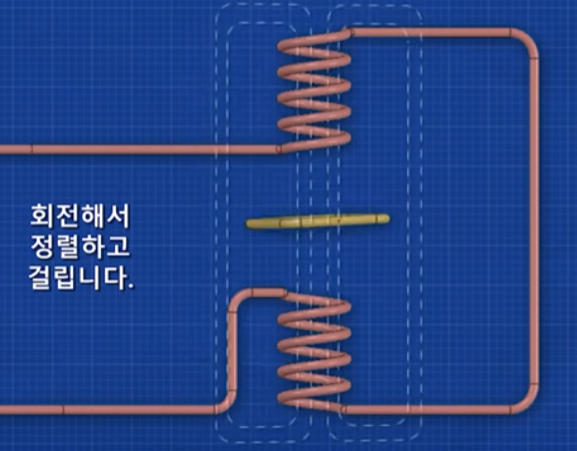

 

이를 극복하기 위해 고정자에 코일 세트를 더 추가해야한다.

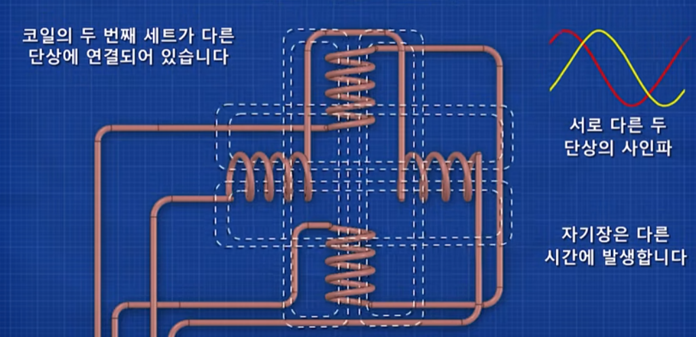

새로운 코일 세트는 다른 단상 (다른 Phase)에 연결되어 있다. 

    따라서 코일 세트들의 자기장이 서로 다른 시간에 발생한다. 

이제 회전자가 회전하게 된다.

 

`3상 AC Motor`에 대해 더 자세히 알아보자

3상 유도 모터 내부에는 회전하는 전자기장을 생성하는 3개의 코일 세트가 있다.

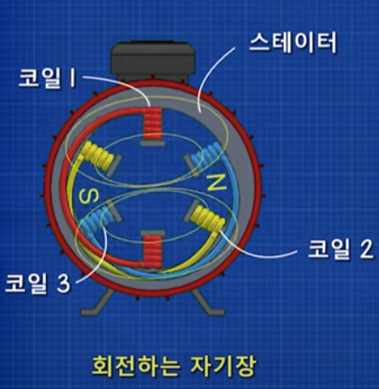

 

각 코일을 통해 전류를 통과시키면 코일을 각각 전자기장을 생성한다.

    전자기장의 크기와 양극성이 반복해서 변한다.

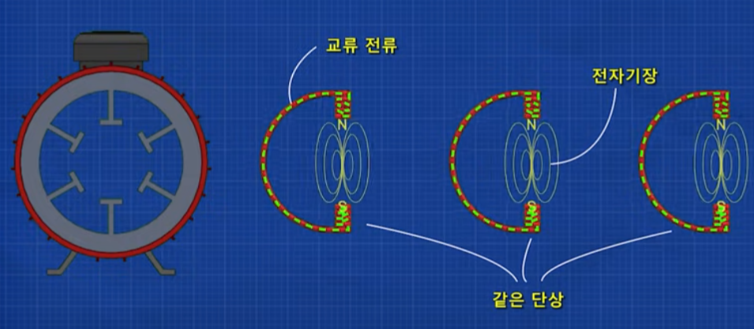

 

하지만 각 코일에 흐르는 전류의 단상(Phase)을 모두 다르게 한다면,

`각 코일에 의해 만들어지는 전자기장은 각각 다른 시간에 크기와 방향을 바꾼다.`

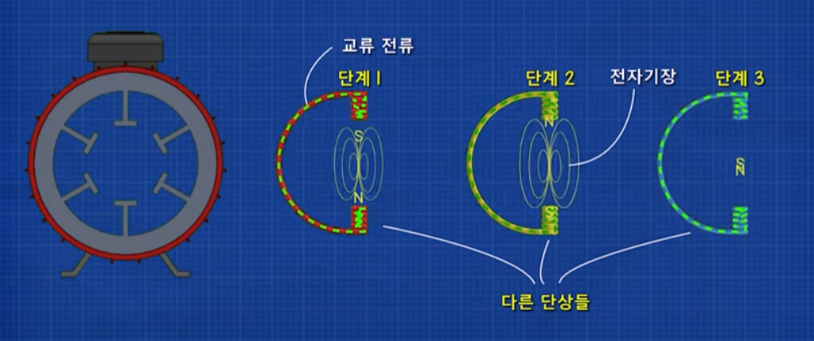

 

사실 회전하는 자기장은 120도의 위상 차이를 가진 3개의 자기장이 변화하는 모습인 것이다. 

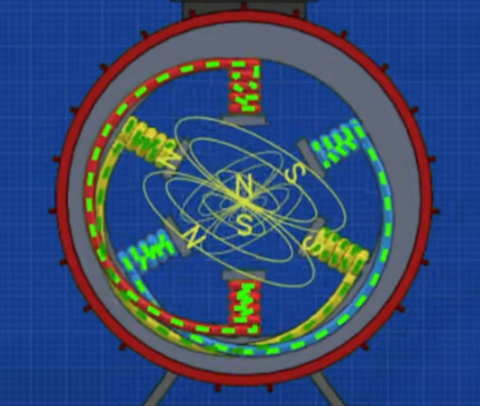

스쿼럴 케이지 로터의 양 끝은 단락되어있어, 각 Bar가 모두 전기적으로 독립되어있다.

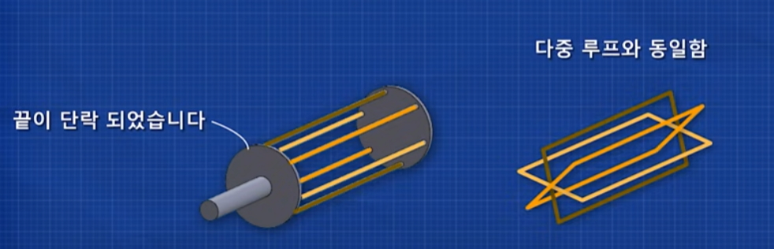

 

따라서 각 Bar가 각각의 자기장을 생성하고, 또 유도 전류가 흐르게 된다.

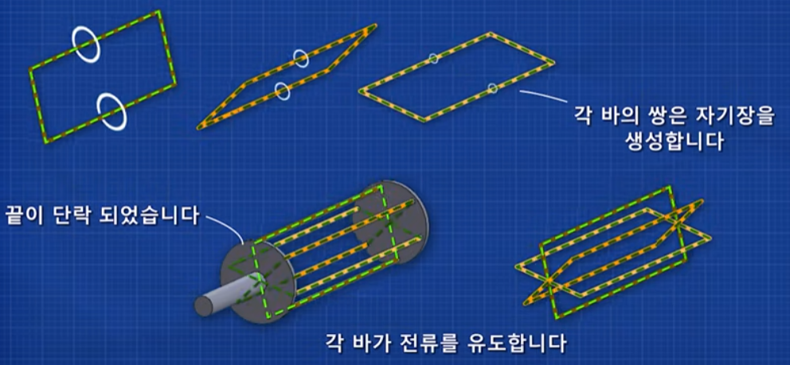

 

즉, 각 Bar가 고정자의 자기장과 상호작용한다.

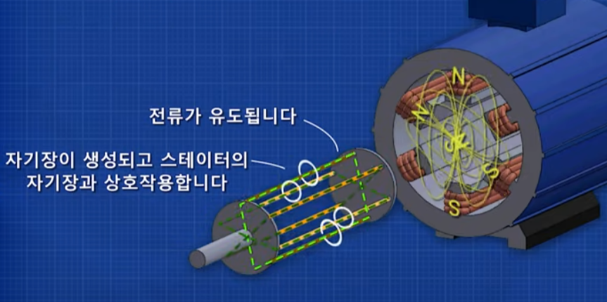

회전자의 Bar에 생성되는 자기장은 고정자의 자기장과 상호작용한다.

회전자의 자기장은 고정자의 자기장에 끌리게 때문에, 고정자의 자기장이 회전하는 것을 따라간다.

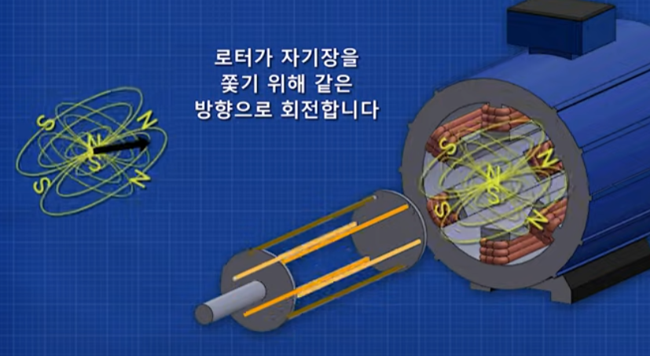

즉, 회전자가 고정자의 자기장을 쫒기 위해 회전자의 자기장 회전방향을 따라간다.

 

회전자의 Bar는 비스듬히 되어 있는데, 이렇게 하면 자기장이 여러 Bar에 분산되고 모터의 정렬을 방지한다. 

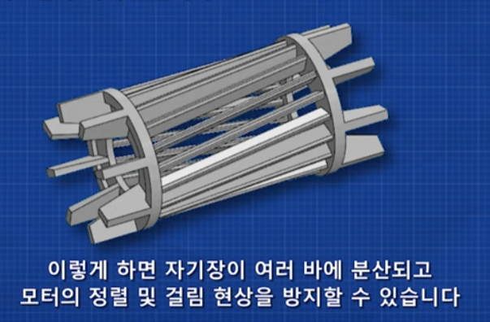

 
- 참고자

[youtube](https://www.youtube.com/watch?v=aU4pvdcI0kw)
