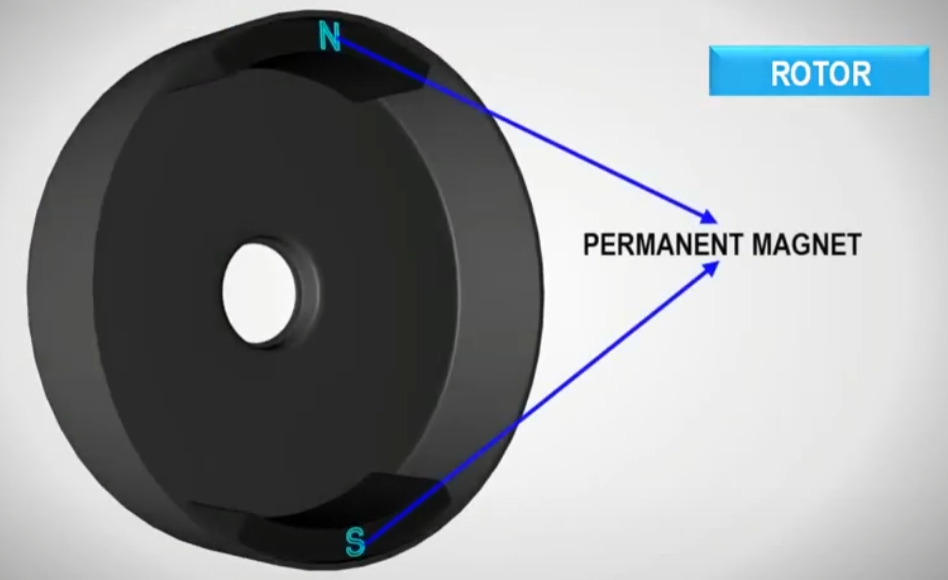
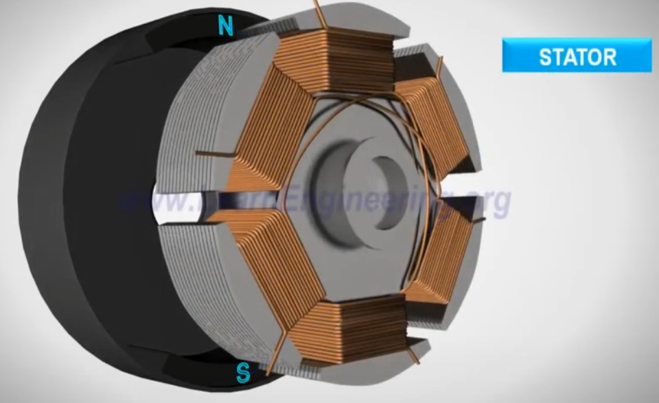
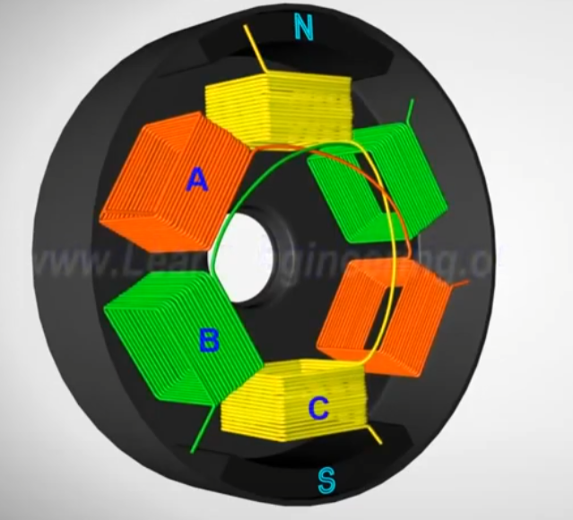
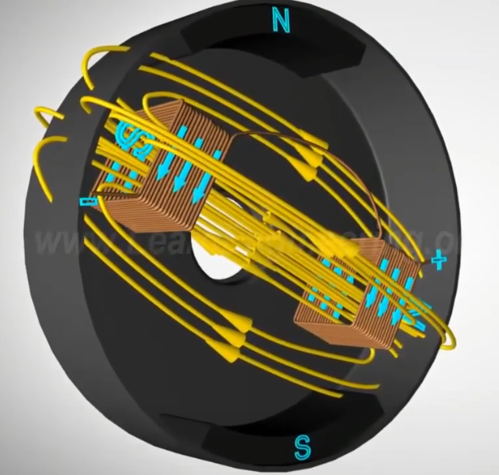
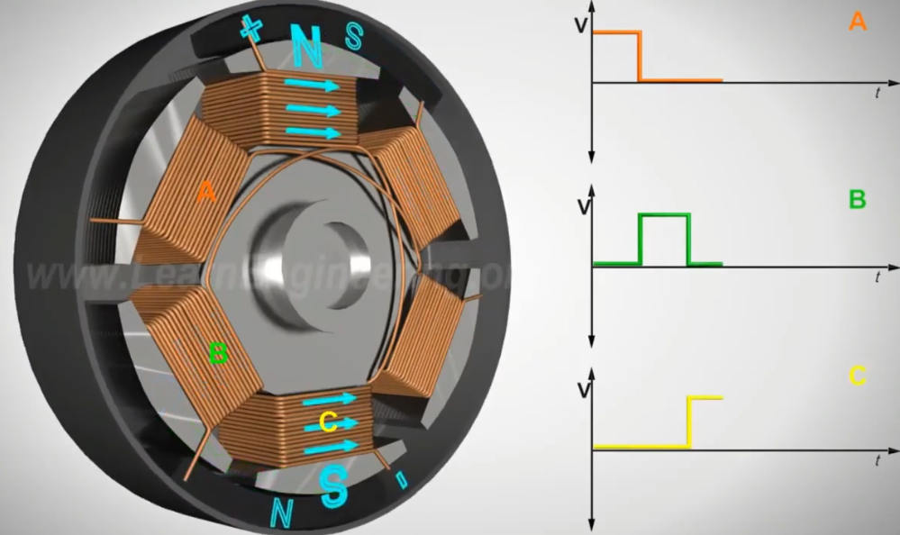

### `About BLDC Motor`

- 브러쉬가 없는 DC Motor
- BLDC Motor의 회전자는 영구자석, 그리고 고정자는 코일이다. (DC Motor와는 반대)

---

 

- `회전자(로터)`

회전자는 영구자석이다.

 

- `고정자(Stator)`

고정자는 코일이 감겨져있다.

 

코일은 다음과 같이 하나의 쌍을 이루고 있고, 전류를 흘려주게 되면 같은 쌍의 코일에 전류가 흐른다.

 

이때 코일에 DC 전류를 넣어주면 해당 코일에 자기장이 형성된다. `즉, N극과 S극이 생긴다.`  

 

- `BLDC의 동작`

BLDC는 `회전자의 영구자석` 과 `고정자의 전자석` 과의 인력, 척력으로 동작한다!   

A 코일 -> B 코일 -> C 코일에 순서대로 전류를 흘려보내 회전자가 돌 수 있게 만든다.

        전류를 알맞은 타이밍에 알맞은 코일에 흘려보내기 위해 모터 컨트롤러를 사용한다. 

        이를 위해 센서를 사용하는데 대부분 홀-효과 센서를 사용한다. 
