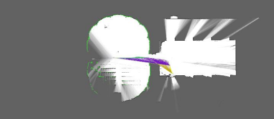
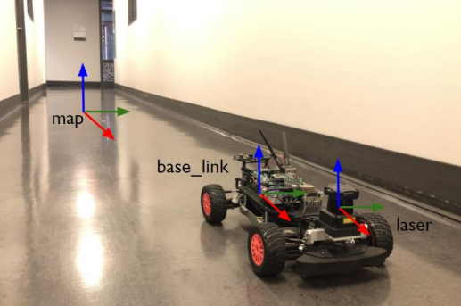
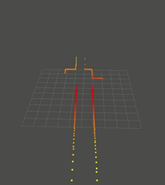
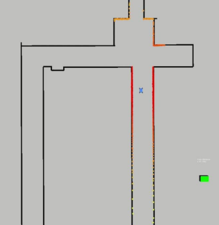
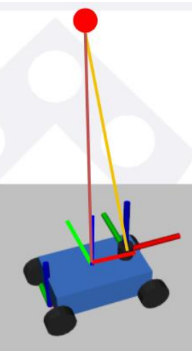
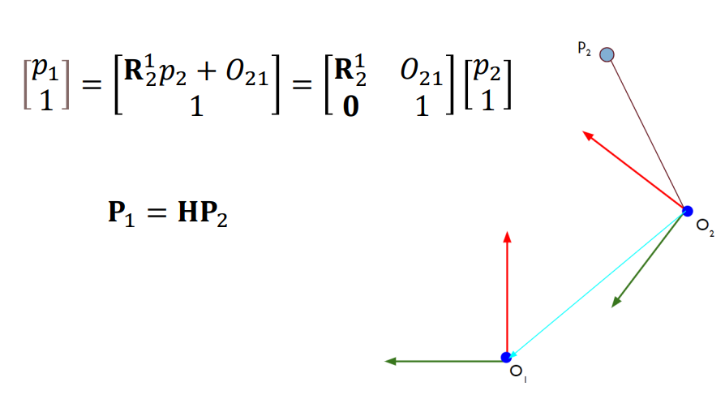

## Frame Transformation for Navigation 

- Rigid Body Frame Transformation
---

- Why Frame Transformation?

        Sensor가 위치한 곳에서 Sensor data가 뽑혀나온다. 

        만약 이 Sensor data가 거리에 대한 것이라면 해당 측정 기준 위치가 중요한 의미를 가진다.

        따라서 Sensing되는 데이터를 기준 좌표에 대해서 처리해주는 것이 필요하다.

        Ex) Rader sensor , Ridar Sensor ...

 

- Google Cartographer

       Google Cartographer는 로봇이 만들어내는 작은 submap들을 합쳐서 global map을 만든다.
    
       이 submap들을 합치기 위해서 각 submap들의 관계와 위치를 알아야한다.
    
       즉, Robot의 Localization이 중요해진다.

 

- Frames

`크게 3가지 Frame을 고려한다.`

`1. Laser Frame` `2. Base line Frame` `3. Map frame`

 

- Laser Frame

Map frame에 대해서 상대적으로 움직이는 Frame

Base link frame에 대해서는 고정이다. (Rigid body)

     주변 환경으로부터 Lidar의 센싱 데이터를 받아오면서 만들어지는 frame이다.
  
     Localization을 위해 Map Frame에 대해서 위치를 추정하는데 사용된다.  

 

- Map frame

Robot이 Map을 만들기 시작하는 곳을 보통 원점으로 설정하며, 로봇의 주변 환경을 보여준다. 

       Robot이 얻은 Sensing data를 모두 보여주는 Map
  
       이 Map에서 Laser Frame이 만들어 낸 특정 데이터들이 어느 곳인지 추정하여 로봇의 위치를 추정한다.

 

 

- Base link frame

보통 차량 뒷 바퀴 중앙을 Frame의 기준으로 놓는다

Map frame에 대해서 상대적으로 움직인다.

Laser frame에 대해서는 고정이다. (Rigid body)

 

 

### Rigid Body Position 

각 Frame들을 정의하고 고정시켰으면, 해당 frame의 데이터를 특정 기준 좌표계에 대해서 나타낼 수 있다.

    Laser Frame의 데이터를 차량 중앙의 기준 좌표계에 대해서 나타낼 수 있다.

 

    Homogeneous Transformation 사용 - Robot Kinematics 참고

 

 

### Odometry

Frame은 아니지만, Localization의 한 방법이라 추가적으로 설명

바퀴의 회전수를 계산하여 로봇의 위치를 추정하는 방법이다.

     왼쪽 바퀴 10바퀴 + 오른쪽 바퀴 10바퀴 == 직진

     왼쪽 바퀴 20바퀴 + 오른쪽 바퀴 10바퀴 == 우회전
  
     왼쪽 바퀴 10바퀴 + 오른쪽 바퀴 20바퀴 == 좌회전

