### PID Contorller

- 가장 기본적인 시스템 제어 방법
- 로봇의 경로나 출력 등을 제어하는데 두루 사용되는 방법이니 잘 기억해두자

---

 

#### Background  

로봇의 센서의 부정확성, 시스템 actuator의 부적확성 그리고 외란에 대해서 `로봇은 Robust하지 않다.`

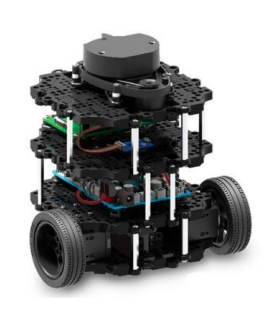

- 제어 대상 : 제어하려는 대상 (자동차, 로봇)
- 엑츄에이터 : 조작량을 변화시킬 수 있는 구조 (핸들을 돌리는 팔, 브레이크를 밟는 다리)
- 컨트롤러 : 제어 신호를 주는 것 (제어 시스템의 머리)

- Plant : 제어 대상 + 엑츄에이터

- 조작량 : 제어 목적을 달성하기 위해서 우리가 조작해야하는 것 (브레이크 밟는 정도)
- 제어량 : 제어 해야하는 양 (자동차 속도)

 

`Feedforward System`

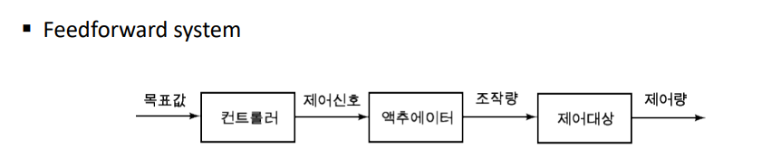

`Feedforward system`은 외란에 robust하지 않다. 외란에 신경쓰지 않고 출력만 내면 되는 시스템에 사용한다

ex) 샤워기 

 

`Feedback system`

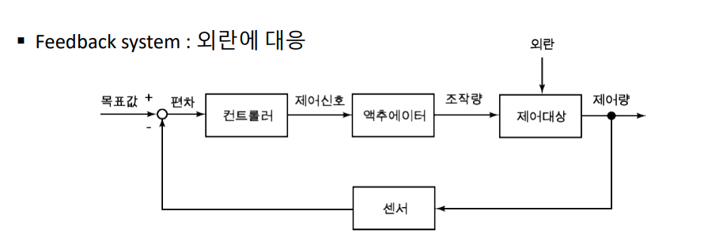

`Feedback system`은 여러 가지 외란과 시스템의 부정확성을 커버해주며 오차를 줄여나가는 방식으로 동작한다.

ex) Cruise Control

 

우리가 설계하는 것은 Plant가 아니라 Controller이다.

    이 Controller를 통해 시스템이 우리가 원하는 출력을 내도록 제어하는 것!

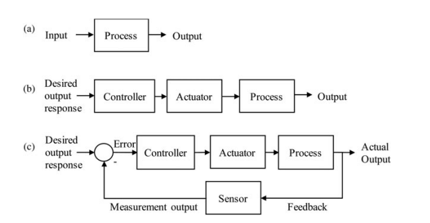

 

- Engine Speed Controll 예시

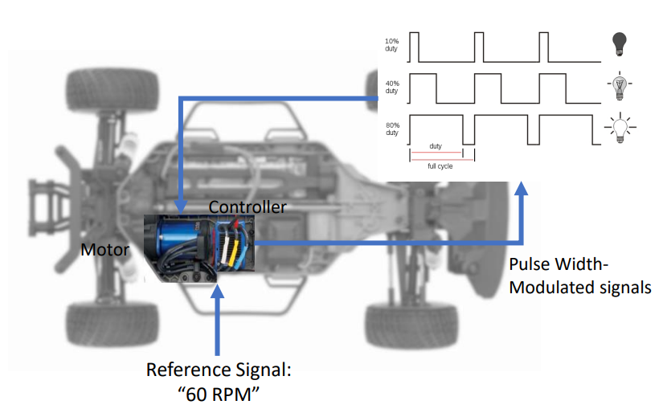

여기서 우리가 제어할 것은 전류이다.

속도를 높이고 싶다면 전류를 높이고, 반대로 늦추고 싶다면 전류를 줄이면 된다.

하지만 실제 출력 결과를 보면 reference Value를 따라가긴 하지만 매우 모양새 없이 따라간다. 

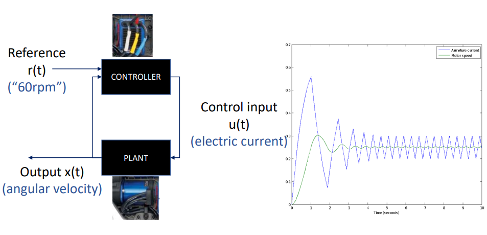

여기서 우리는 출력된 값 x(t)를 다시 받아와서 reference r(t)와의 차이를 구한다.

`e(t) = r(t) - x(t) : error`

    이 e(t)를 0에 가깝게 만드는 것이 Controller 설계 목표이다!

 

- Path Tracking 예시

- 로봇청소기의 기본적인 기능 중 하나인 `Wall Following`

로봇이 벽에서 일정한 거리를 두고 쭉 따라가도록 하고 싶다.

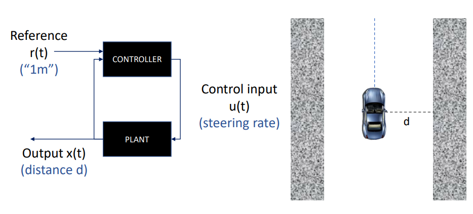

이 때 로봇은 센서를 통해 벽과의 거리를 계산한다.

이 계산된 거리에 따라 출력을 달리하며 reference distance 1m 를 유지하려한다.

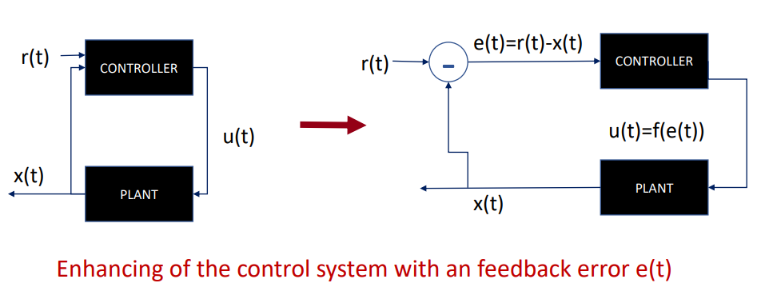

우리는 Controller를 reference 거리와 실제 측정된 거리 사이의 오차를 줄여나가도록 설계해야한다.

    feedback system 내에서 Controller를 꾸미자!

 

#### PID Control

P : 비례 제어 = 에러의 크기에 따라 제어 
I : 적분 제어 = 에러가 어느 정도 쌓이면 제어
D : 미분 제어 = 에러의 방향성에 따라 제어 

 

- P Control

    L*sin(θ) > 0 이면 아래로 내려와야한다.
    L*sin(θ) < 0 이면 위로 올라가야한다. 

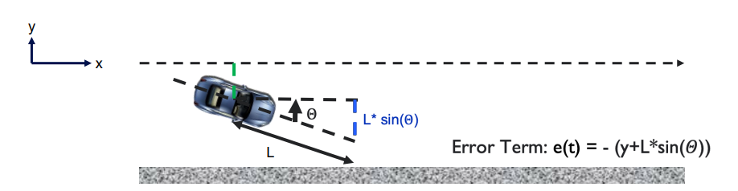

    y > 0 이면 차는 왼쪽 방향에 있다.   (L*sin(θ) > 0)
    y < 0 이면 차는 오른쪽 방향에 있다. (L*sin(θ) < 0)

 

    Error e(t) = (-y - L*sin(θ))

 

- P 제어

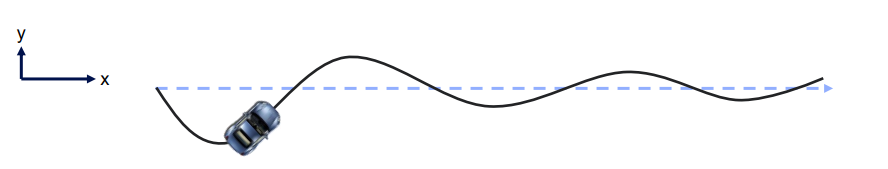

결과적으로 P제어를 하면 위와 같이 진동하는 경로를 그린다.

자동차가 위로 올라가면 내려주고, 내려가면 올려주는 것을 반복하기 때문이다.

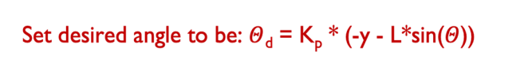

 

- D control

미분 제어 : error가 어느 쪽으로 커지고 있는 지를 계산해서 이를 줄여주는 방법

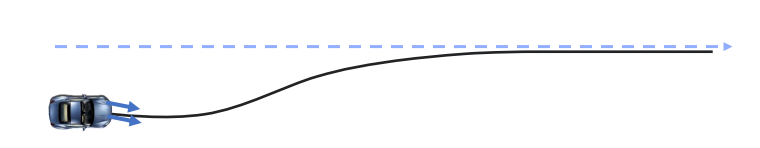

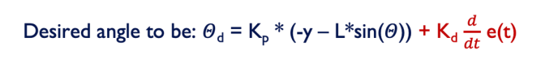

    Overshoot 제거

 

- I Control

적분 제어 : error가 어느 정도 쌓이면 제어를 수행하는 방법

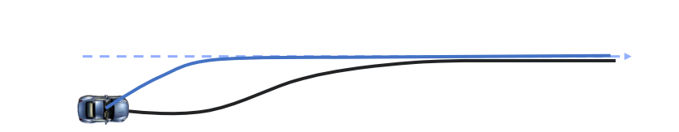

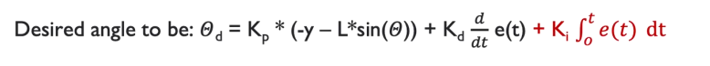

    1. 정상 상태 오차 제거
    2. 응답 속도 개선 

 

#### PID Controller 정리

    Error의 크기에 맞추어 P 제어를 수행한다  - 정상 상태 오차 제거 
    Error의 방향에 맞추어 제어를 수행한다    - 오버슈트 제거 
    Error의 양이 쌓이면 제어를 수행한다      - 정상 상태 오차 제거

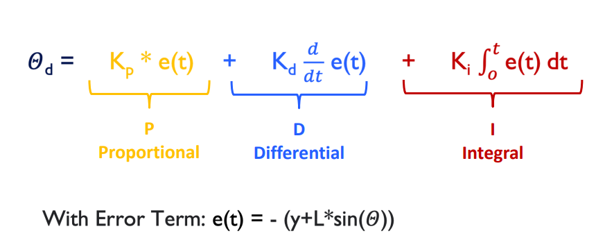

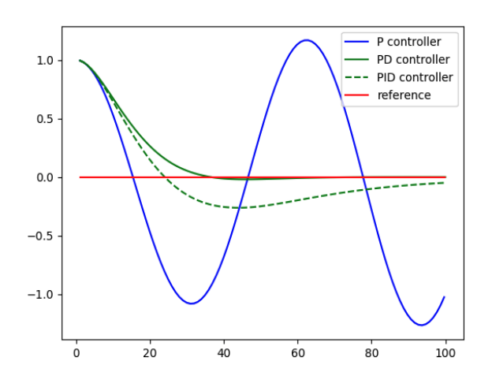

    PID Gain에 대해서는 실험적으로 Fine-tuning하는 것이 보통이다.
    
    하지만 시작 시 가이드 라인 정보는 알 수 있는데, Ziegler-Nichols 방법을 가장 많이 사용한다.

