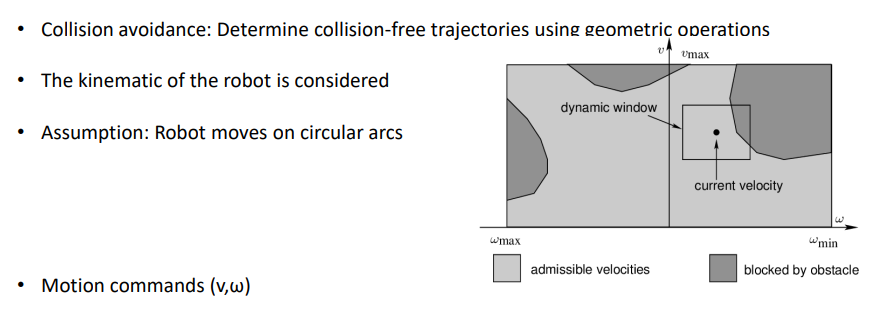
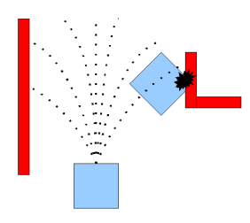
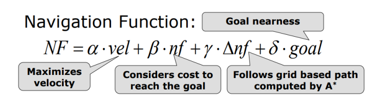
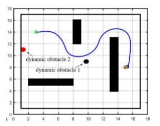

#### Local Path Planning 2 : 'Dynamic Window Approach`

`DWA 또한 Collision Avoidance Algorithm이다.`

    DWA는 로봇의 운동학적인 요소도 고려하며 설계된 알고리즘이다.

    로봇은 항상 원호를 그리며 움직인다고 가정하고, 따라서 속도와 가속도의 명령만 넣어준다.

    속도와 가속도는 Heuristic Navigation function을 통해 최적화된 값을 얻어낸다.

1. 우선 로봇이 낼 수 있는 최대 속도, 가속도의 좌표를 만든다.
2. 현재 로봇의 속도, 가속도를 좌표 상에 표현한다
3. 현재 위치에서 로봇의 물리적 요인을 고려하여 특정 Time Interval 동안 낼 수 있는 속도, 가속도의 범위를 만든다. `= Window`

    이제 만들어 놓은 Dynamic Window 내에서 물체와 충돌하지 않을 속도와 가속도를 선택해야한다.
    이 속도와 가속도는 Heuristic Navigation function을 통해 최적의 값을 선택한다.

 

`Heuristic Navigation function`은 다음과 같다.

각 계수는 모두 가중치이며, 네 가지 term을 통해 V, W를 최적화한다.

 

 
