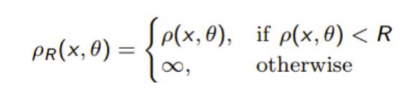
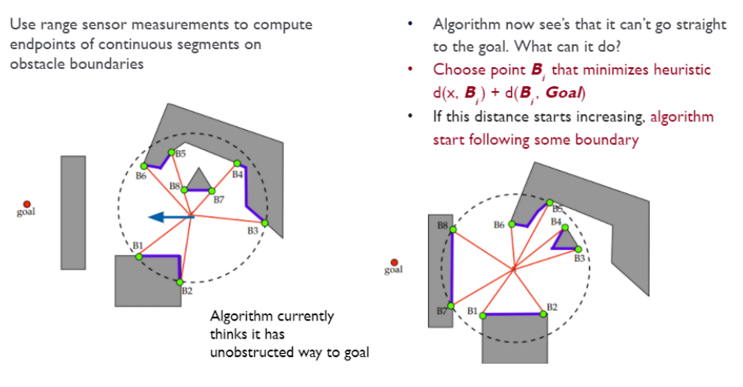
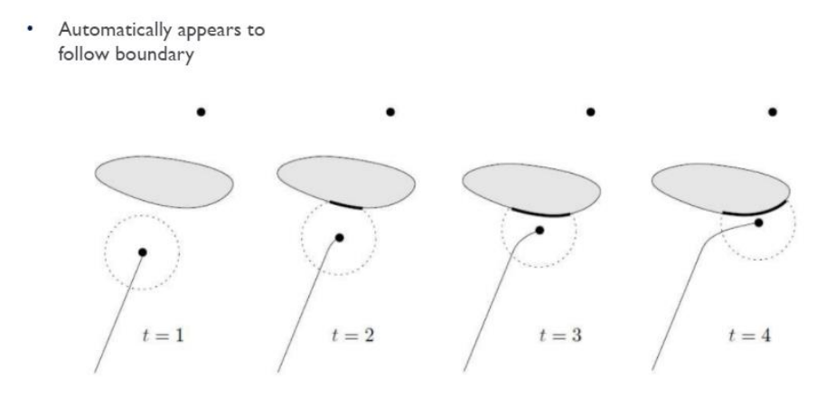

#### Local Path Planning 3 : 'Tangent Bug Algorithm`

`Tangent Bug Algorithm`은 Global Map 없이 Lidar로 주변 환경을 추정하며 주행하는 알고리즘이다.

[youtube](https://www.youtube.com/watch?v=wuTrGFAw3ew)

        다만 목표 지점의 위치와 방향은 알고 있어야한다.
        이것이 이 알고리즘의 단점으로 여겨진다. 현실에서는 목적지와의 거리를 얻기 쉽지 않다.

`Bug Algorithm`은 Lidar로 주변 물체들의 위치와 각도를 얻고 이를 통해 거리 정보를 얻는다.

        x,y 좌표 뿐 아니라, 해당 좌표의 로봇과의 상대적 위치를 알기 위해 각도 정보가 필요

p 값은 Lidar로 측정한 가까운 물체와의 거리를 나타낸다.

아래 식은 `Saturated distance function`이다.

만약 Lidar를 통해 얻는 값들의 list가 **[inf, 7, 4, 6, 6, 5, 4]** 이고, R = 5 라면,

이 list는 **[inf, inf, 4, inf, inf, inf, 4]** 로 변환된다.

 

알고리즘의 Flow는 다음과 같다. 

 

1. Lidar 값들을 받아 Saturated distance function으로 변환한다.
2. 이 후 측정 범위 내에서 heuristic을 최소화 하는 다음 지점 B를 선택한다. 

    이 B는 (현재 ~ 다음 지점) + (다음 지점 ~ 목표 지점) 을 최소화 하는 지점이다.

3. 만일 distance 값이 증가하기 시작한다면, 이는 벽을 만난 것으로 생각하고 경계선을 따르는 알고리즘을 시작한다.

 

