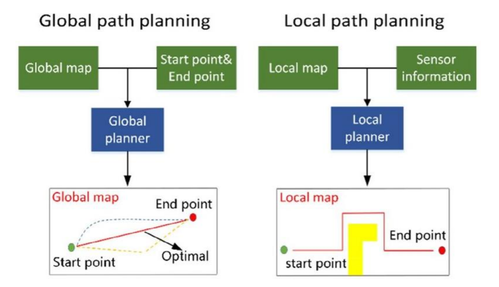

### Local Path Planning 

- List

1. Follow the Gap
2. Dynamic Window Approach
3. Tangent Bug Algorithm
4. Artificial Potential Fields

 

`Local Path Planning ( Collision Avoidance )`

- Local Path Plainnig : 주변의 장애물을 인식하고 회피하며 주행하는 알고리즘

       AEB는 충돌 감지 후 정지하는 알고리즘이며 Collision Avoidance는 충돌을 회피하며 주행하는 알고리즘이다

---

- Global vs Local 

`Global Path Planning` : Global Map에 대한 정보를 아는 상태에서의 (출발 - 도착) 지점 간의 경로 설정 알고리즘

`Local Path Planning` : Sensor Scan Map에 대한 그 순간의 지도를 바탕으로 하고, 주변의 장애물을 회피하는 알고리즘

