### SLAM 

`SLAM : Simulataneous Localization and Mapping`  

    :  로봇의 위치를 추정하는 동시에 Map을 생성하는 알고리즘`

---

 

- Localization

주변의 `Landmark(고정된 Feature)`를 이용해서 로봇의 위치를 추정

Landmark가 주어질 때, 로봇의 센싱 데이터(거리.. )를 통해 현재 위치를 추정  

Ex) 2D : (x, y, θ)

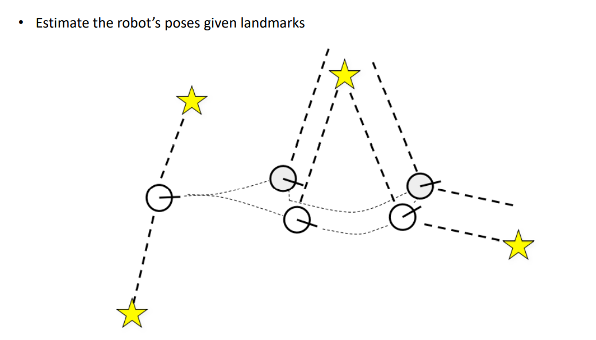

 

- Mapping

로봇의 위치를 알고 있을 때, 주변 Landmark들을 파악

정확한 센서와 함께 현재 위치를 알고 있다면, 센싱 데이터를 통해 발견한 Landmark를 특정 위치에 Mapping 할 수 있다.

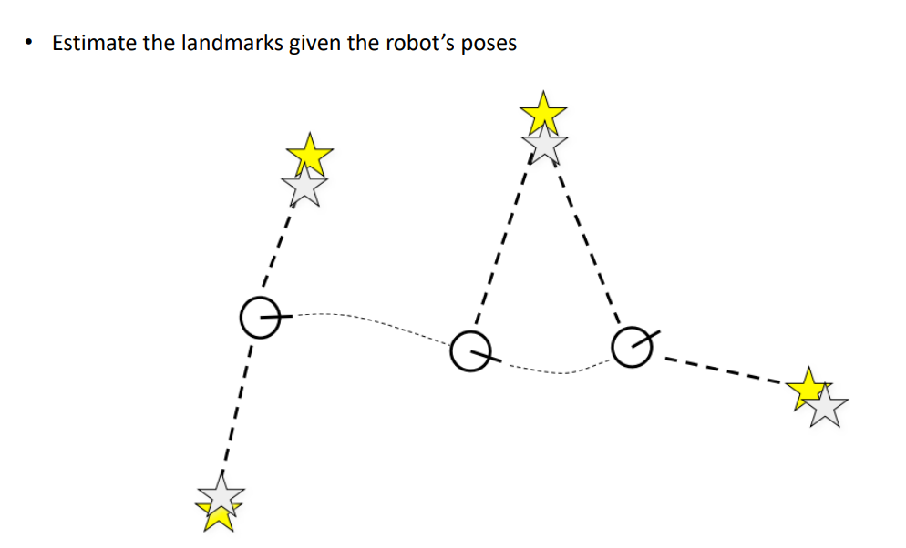

 

- SLAM  (Localization + Mapping)

센서를 이용해서 주변 지도를 만들어내고, 동시에 센서 플랫폼(로봇)의 위치를 현재까지 만들어진 지도를 기반으로 추정

    센서 : LIDAR, Camera, ...

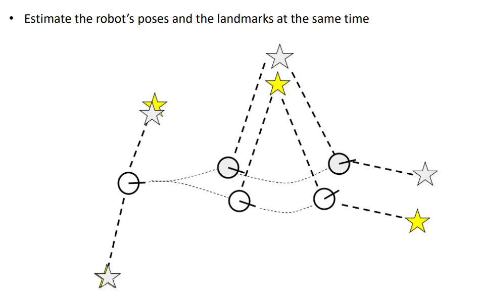

 

---

- SLAM

알 수 있는 정보 

    1. Robot Control (바퀴가 굴러간 수 , ... )
    2. Observation (LIDAR, Camera, ...)  

알고 싶은 정보 

    1. Map 
    2. Path of Robot (로봇의 시간에 따른 위치들 --- 경로) 

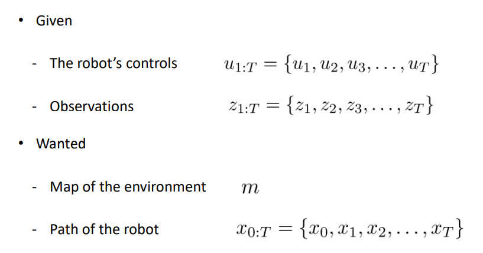

결국 우리는 로봇의 HW 제어 정보와 센서를 통한 데이터로 Map과 로봇의 위치를 찾아낼 것이다. 

        SLAM은 추정의 불확실성 또한 명확하게 포함시키기 위해 확률적으로 접근한다.

주로 Gaussian 분포를 사용한다. 

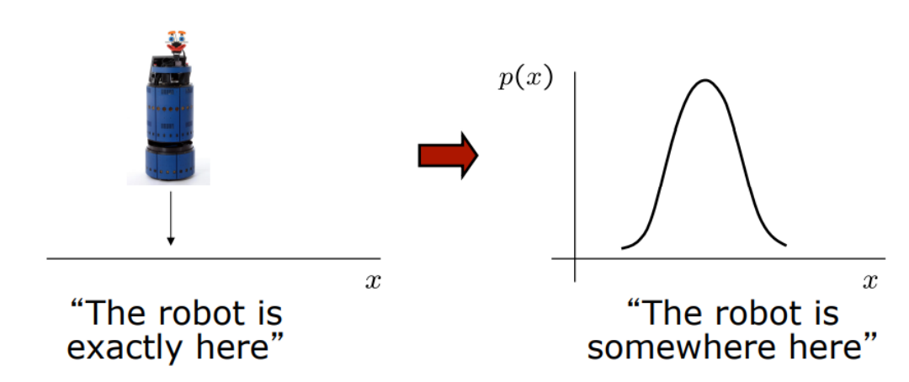

즉, 다음 수식과 같다. (Full SLAM)

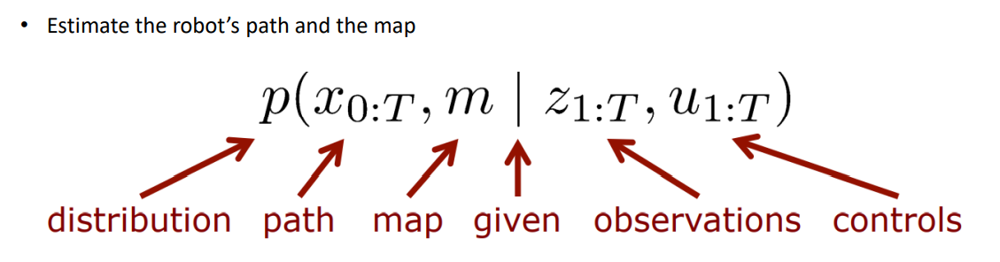

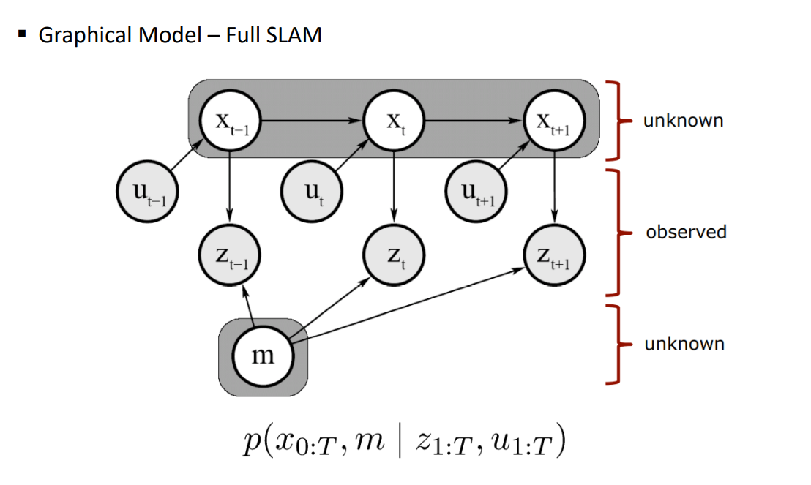

다음은 지금까지의 정보를 가지고, Online으로 SLAM을 수행하는 Online SLAM이다.

실질적으로 더 많이 사용하는 SLAM이다.

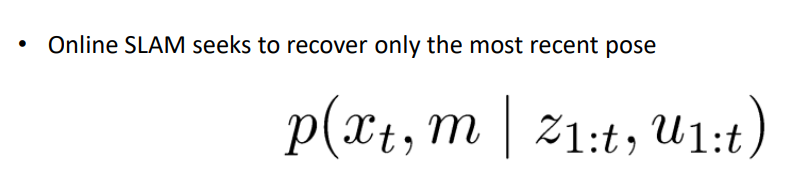

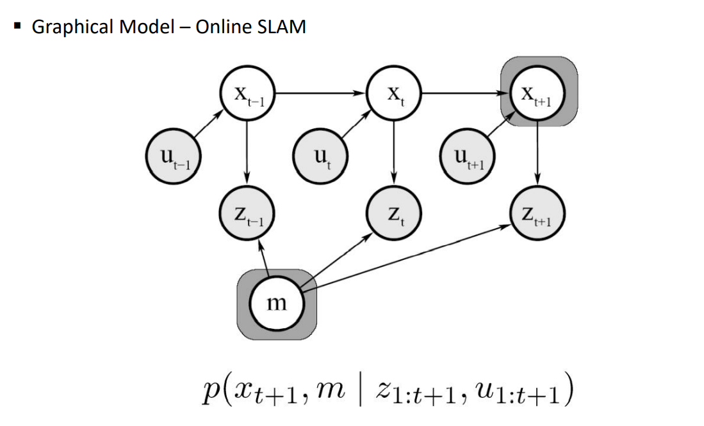

 

- Motion model / Observation Model

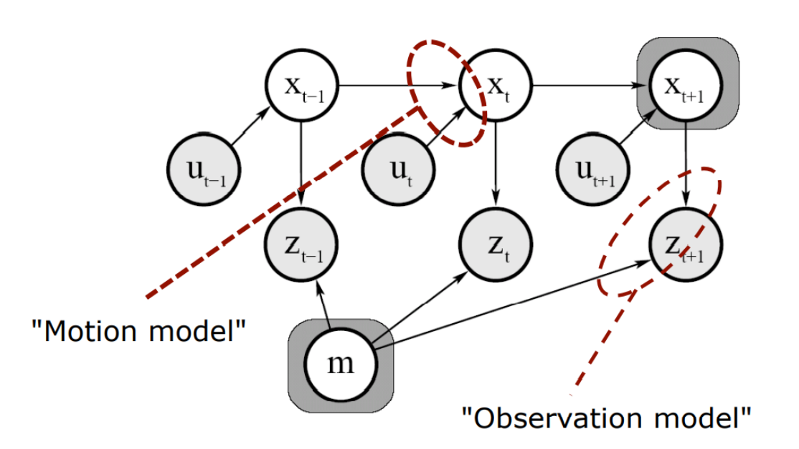

`Motion model : 이전의 로봇의 위치와, Control이 주어졌을 때 새 위치를 추정`

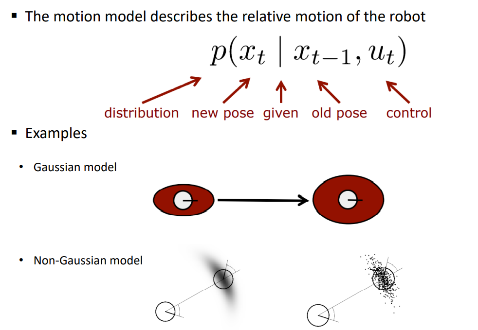

`Observation model : 현재 로봇의 위치를 통해 관찰된 Z의 븐포`

        내 로봇을 기준으로 5cm 옆에 벽이 있다 --- 확률적으로 벽이 있을 확률이 높다

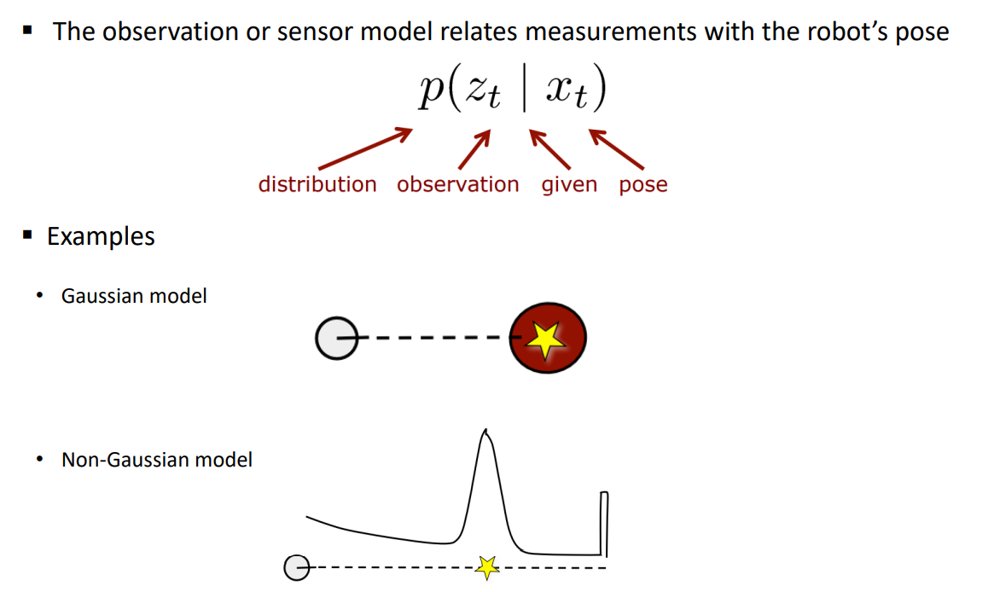

