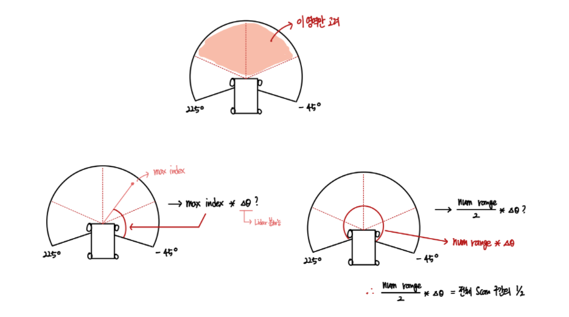
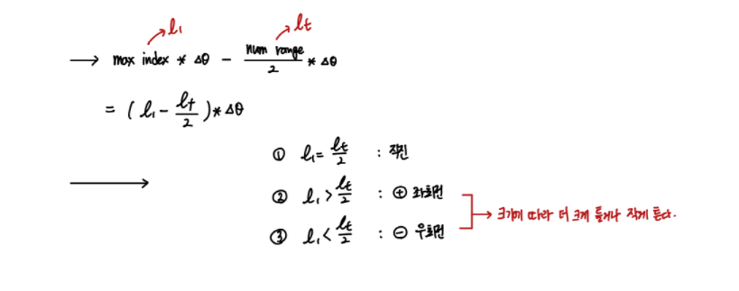

### Robot Navigation mid term project - `F1 TENTH Driving Algorithm`

- Consider point

        1. 직선 거리에서는 빠르게
            - Momentum 
            - 주변 센싱 거리가 일정 거리 이상일 때 사용 (AEB 고려)
            
        2. 코너에서는 정확하게 
            - 확률적으로 접근해보기

#### Furtest Drive Algorithm 

- Steering Part : `Ackerman Steering 구조 사용`

```python

    class FurtestDrive():
        
        def lidar(self, ranges):
          
          NUM_RANGES = len(ranges)        
          ANGLE_BETWEEN = 2 * np.pi / NUM_RANGES
 
          NUM_PER_QUADRANT = NUM_RANGES // 4
          max_idx = np.argmax(ranges[NUM_PER_QUADRANT:-NUM_PER_QUADRANT]) + NUM_PER_QUADRANT
          
          steering_angle = max_idx * ANGLE_BETWEEN - (NUM_RANGES // 2) * ANGLE_BETWEEN
          speed = 5.0

          return speed, steering_angle 

```    

steering에 대해서 다음 그림을 통해 이해해보자.

<div align="center">



`조향각도 결정`



</div>